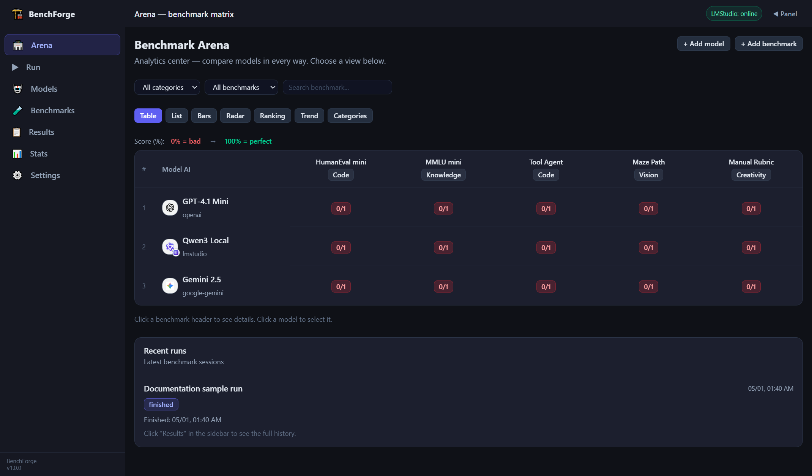
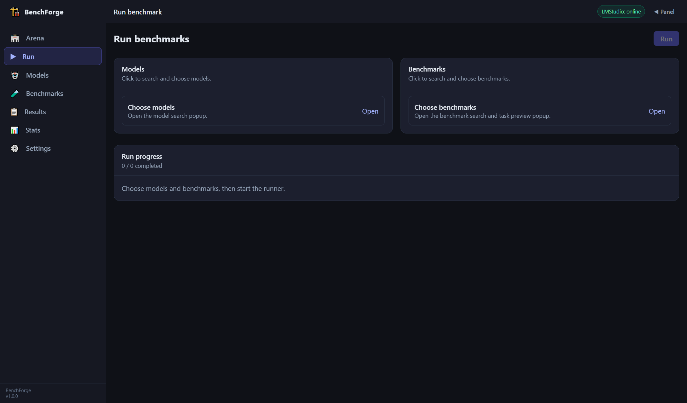
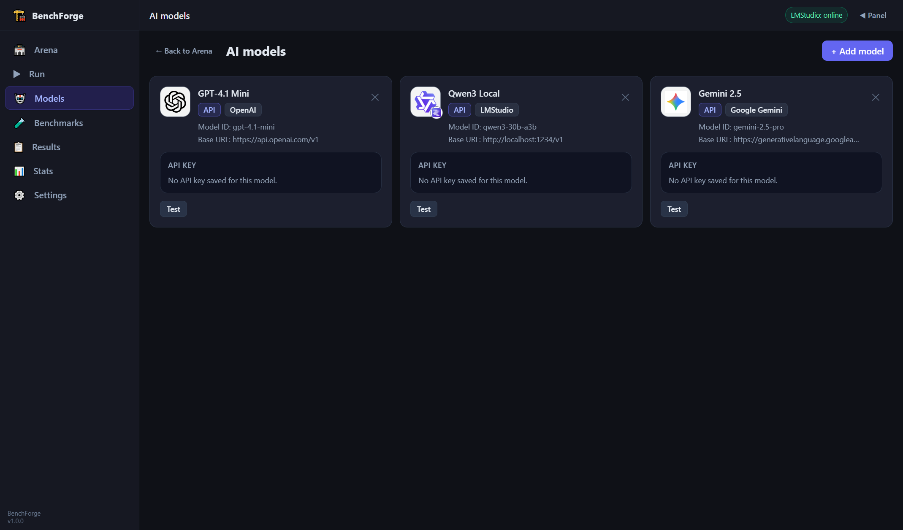
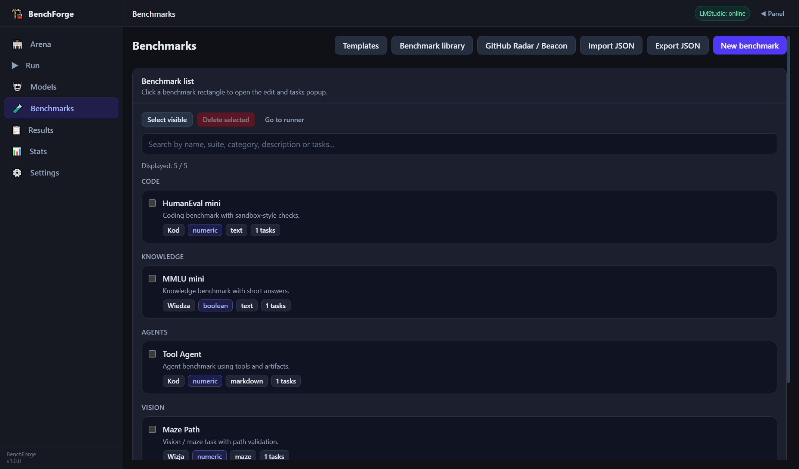
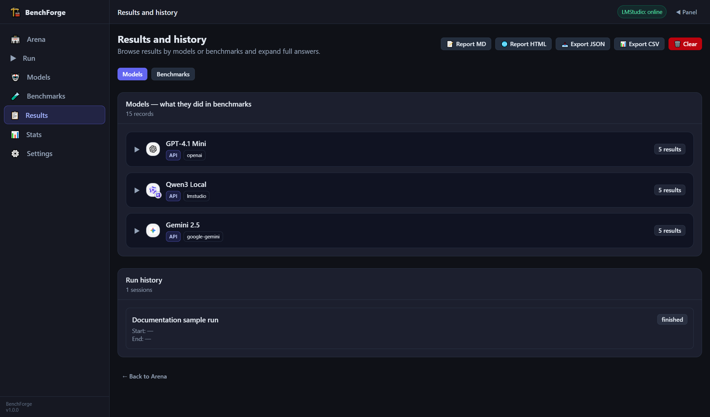
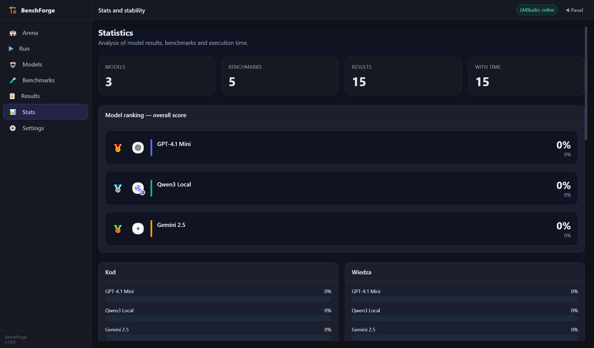
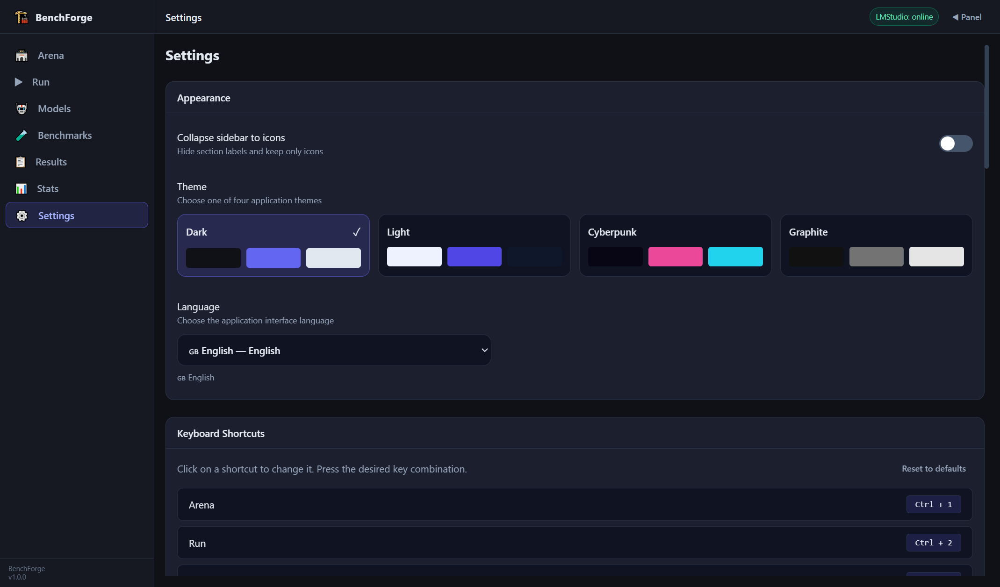

# BenchForge

AI model benchmarking desktop app with custom benchmarks, sandboxed code evaluation, tool/MCP agent tests, result analytics, artifact exports, and a multilingual UI.

## Screenshots

| Arena | Runner |
|---|---|
|  |  |

| Models | Benchmarks |
|---|---|
|  |  |

| Results | Stats |
|---|---|
|  |  |

| Settings |
|---|
|  |

<a id="languages"></a>

## Languages / Języki

- [🇬🇧 English / English](#en)
- [🇵🇱 Polski / Polish](#pl)
- [🇩🇪 Deutsch / German](#de)
- [🇪🇸 Español / Spanish](#es)
- [🇫🇷 Français / French](#fr)
- [🇮🇹 Italiano / Italian](#it)
- [🇵🇹 Português / Portuguese](#pt)
- [🇺🇦 Українська / Ukrainian](#uk)
- [🇨🇿 Čeština / Czech](#cs)
- [🇳🇱 Nederlands / Dutch](#nl)
- [🇹🇷 Türkçe / Turkish](#tr)
- [🇷🇺 Русский / Russian](#ru)
- [🇬🇷 Ελληνικά / Greek](#el)
- [🇸🇪 Svenska / Swedish](#sv)
- [🇳🇴 Norsk / Norwegian](#no)
- [🇩🇰 Dansk / Danish](#da)
- [🇫🇮 Suomi / Finnish](#fi)
- [🇭🇺 Magyar / Hungarian](#hu)
- [🇷🇴 Română / Romanian](#ro)
- [🇧🇬 Български / Bulgarian](#bg)
- [🇭🇷 Hrvatski / Croatian](#hr)
- [🇸🇰 Slovenčina / Slovak](#sk)
- [🇸🇮 Slovenščina / Slovenian](#sl)
- [🇱🇹 Lietuvių / Lithuanian](#lt)
- [🇱🇻 Latviešu / Latvian](#lv)
- [🇪🇪 Eesti / Estonian](#et)
- [🇷🇸 Српски / Serbian](#sr)
- [🇦🇩 Català / Catalan](#ca)
- [🇪🇸 Euskara / Basque](#eu)
- [🇪🇸 Galego / Galician](#gl)
- [🇮🇪 Gaeilge / Irish](#ga)
- [🏴 Cymraeg / Welsh](#cy)
- [🇮🇸 Íslenska / Icelandic](#is)
- [🇲🇹 Malti / Maltese](#mt)
- [🇦🇱 Shqip / Albanian](#sq)
- [🇲🇰 Македонски / Macedonian](#mk)
- [🇧🇾 Беларуская / Belarusian](#be)
- [🇧🇦 Bosanski / Bosnian](#bs)
- [🇱🇺 Lëtzebuergesch / Luxembourgish](#lb)
- [🇬🇧 Gàidhlig / Scottish Gaelic](#gd)
- [🇫🇷 Brezhoneg / Breton](#br)
- [🇫🇷 Corsu / Corsican](#co)
- [🇳🇱 Frysk / Frisian](#fy)
- [🇨🇳 简体中文 / Chinese Simplified](#zh)
- [🇹🇼 繁體中文 / Chinese Traditional](#zh-TW)
- [🇯🇵 日本語 / Japanese](#ja)
- [🇰🇷 한국어 / Korean](#ko)
- [🇮🇩 Bahasa Indonesia / Indonesian](#id)
- [🇻🇳 Tiếng Việt / Vietnamese](#vi)
- [🇹🇭 ไทย / Thai](#th)
- [🇮🇳 हिन्दी / Hindi](#hi)
- [🇸🇦 العربية / Arabic](#ar)
- [🇮🇱 עברית / Hebrew](#he)
- [🇮🇷 فارسی / Persian](#fa)
- [🇵🇰 اردو / Urdu](#ur)
- [🇲🇾 Bahasa Melayu / Malay](#ms)
- [🇵🇭 Filipino / Filipino](#fil)
- [🇧🇩 বাংলা / Bengali](#bn)

---

<a id="en"></a>

## 🇬🇧 English / English

### What is BenchForge?

BenchForge is a desktop application for comparing AI models on custom and imported benchmarks. It helps with local experiments, model comparison, code evaluation, tool/MCP agent benchmarks, result analytics, exports, and backups.

### Main features

- Model management: local runtimes such as LM Studio and Ollama, OpenAI-compatible API providers, provider presets, and manual copy-paste mode.
- Benchmark management: create, edit, import, export, and use ready-made benchmark packs such as HumanEval, MBPP, GSM8K, SWE-bench, MMLU mini, ARC mini, TruthfulQA mini, MCP benchmarks, and more.
- Evaluation modes: simple answers, code presence checks, Python/Node sandbox tests, TypeScript-lite support, manual rubrics, tool-agent benchmarks, MCP benchmarks, and repo/patch sandbox tasks.
- Analytics: arena matrix, rankings, bar charts, radar charts, trends, result history, sandbox reports, tool traces, CSV/JSON exports, ZIP artifacts, and database backup/import.
- International UI: 58 languages, RTL support for languages such as Arabic, Persian, Hebrew, and Urdu, configurable keyboard shortcuts, and multiple themes.

### Run on Windows

For the quickest local start on Windows, run:

```bat
start-electron.bat
```

### Build release files

To run tests, validate translations, build the frontend, create installers, and generate checksums, run:

```bat
test-and-build.bat
```

### Release artifacts

Windows release files are created in the release folder: NSIS installer, portable EXE, ZIP archive, and SHA256SUMS.txt.

- `BenchForge-Setup-<version>-x64.exe`
- `BenchForge-Portable-<version>-x64.exe`
- `BenchForge-<version>-x64.zip`
- `SHA256SUMS.txt`

### Data and security

App data is stored in the portable-first data folder. API keys and GitHub Radar tokens are encrypted locally with Electron safeStorage when available. Only enable MCP servers, tools, and sandbox directories that you trust.

### Translation note

Some translations are machine-assisted. Corrections and improvements are welcome.

### License

MIT

[↑ Back to languages](#languages)

---

<a id="pl"></a>

## 🇵🇱 Polski / Polish

### Czym jest BenchForge?

BenchForge to desktopowa aplikacja do porównywania modeli AI na własnych i importowanych benchmarkach. Pomaga w lokalnych eksperymentach, porównywaniu modeli, ocenie kodu, benchmarkach agentów/tooli/MCP, analizie wyników, eksporcie i backupach.

### Najważniejsze funkcje

- Zarządzanie modelami: lokalne runtimy LM Studio i Ollama, providery API zgodne z OpenAI, presety providerów oraz tryb manualny copy-paste.
- Zarządzanie benchmarkami: tworzenie, edycja, import, eksport oraz gotowe paczki, m.in. HumanEval, MBPP, GSM8K, SWE-bench, MMLU mini, ARC mini, TruthfulQA mini, benchmarki MCP i więcej.
- Tryby oceny: proste odpowiedzi, code_presence, testy sandbox Python/Node, TypeScript-lite, ręczne rubryki, benchmarki tool-agent, MCP oraz repo/patch sandbox.
- Analityka: arena, macierz, rankingi, wykresy słupkowe, radar, trendy, historia wyników, raporty sandboxa, tool trace, eksport CSV/JSON, artefakty ZIP oraz backup/import bazy.
- Międzynarodowy UI: 58 języków, RTL dla arabskiego, perskiego, hebrajskiego i urdu, konfigurowalne skróty klawiszowe oraz kilka motywów.

### Uruchamianie na Windows

Najprostsze uruchomienie lokalne na Windows:

```bat
start-electron.bat
```

### Budowanie plików release

Aby uruchomić testy, sprawdzić tłumaczenia, zbudować frontend, stworzyć instalatory i wygenerować checksumy, uruchom:

```bat
test-and-build.bat
```

### Artefakty release

Pliki release dla Windows powstają w folderze release: instalator NSIS, portable EXE, archiwum ZIP i SHA256SUMS.txt.

- `BenchForge-Setup-<version>-x64.exe`
- `BenchForge-Portable-<version>-x64.exe`
- `BenchForge-<version>-x64.zip`
- `SHA256SUMS.txt`

### Dane i bezpieczeństwo

Dane aplikacji są przechowywane portable-first w folderze data. Klucze API i token GitHub Radar są szyfrowane lokalnie przez Electron safeStorage, jeśli jest dostępny. Włączaj tylko zaufane serwery MCP, narzędzia i katalogi sandboxa.

### Uwaga o tłumaczeniach

Część tłumaczeń jest wspomagana maszynowo. Poprawki i ulepszenia są mile widziane.

### Licencja

MIT

[↑ Back to languages](#languages)

---

<a id="de"></a>

## 🇩🇪 Deutsch / German

### Was ist BenchForge?

BenchForge ist eine Desktop-Anwendung zum Vergleich von KI-Modellen anhand benutzerdefinierter und importierter Benchmarks. Es hilft bei lokalen Experimenten, Modellvergleichen, Code-Bewertung, Tool-/MCP-Agent-Benchmarks, Ergebnisanalysen, Exporten und Backups.

### Hauptmerkmale

- Modellverwaltung: lokale Laufzeiten wie LM Studio und Ollama, OpenAI-kompatible API-Anbieter, Anbietervoreinstellungen und manueller Kopier-Einfüge-Modus.
- Benchmark-Verwaltung: Erstellen, bearbeiten, importieren, exportieren und verwenden Sie vorgefertigte Benchmark-Pakete wie HumanEval, MBPP, GSM8K, SWE-bench, MMLU mini, ARC mini, TruthfulQA mini, MCP-Benchmarks und mehr.
- Bewertungsmodi: einfache Antworten, Code-Präsenzprüfungen, Python-/Node-Sandbox-Tests, TypeScript-Lite-Unterstützung, manuelle Rubriken, Tool-Agent-Benchmarks, MCP-Benchmarks und Repo-/Patch-Sandbox-Aufgaben.
- Analysen: Arena-Matrix, Ranglisten, Balkendiagramme, Radardiagramme, Trends, Ergebnisverlauf, Sandbox-Berichte, Tool-Traces, CSV/JSON-Exporte, ZIP-Artefakte und Datenbanksicherung/-import.
- Internationale Benutzeroberfläche: 58 Sprachen, RTL-Unterstützung für Sprachen wie Arabisch, Persisch, Hebräisch und Urdu, konfigurierbare Tastaturkürzel und mehrere Themen.

### Unter Windows ausführen

Für den schnellsten lokalen Start unter Windows führen Sie Folgendes aus:

```bat
start-electron.bat
```

### Erstellen Sie Release-Dateien

Führen Sie Folgendes aus, um Tests auszuführen, Übersetzungen zu validieren, das Frontend zu erstellen, Installationsprogramme zu erstellen und Prüfsummen zu generieren:

```bat
test-and-build.bat
```

### Artefakte freigeben

Windows-Versionsdateien werden im Release-Ordner erstellt: NSIS-Installationsprogramm, tragbare EXE-Datei, ZIP-Archiv und SHA256SUMS.txt.

- `BenchForge-Setup-<version>-x64.exe`
- `BenchForge-Portable-<version>-x64.exe`
- `BenchForge-<version>-x64.zip`
- `SHA256SUMS.txt`

### Daten und Sicherheit

App-Daten werden im Portable-First-Datenordner gespeichert. API-Schlüssel und GitHub Radar-Tokens werden lokal mit Electron SafeStorage verschlüsselt, sofern verfügbar. Aktivieren Sie nur MCP-Server, Tools und Sandbox-Verzeichnisse, denen Sie vertrauen.

### Übersetzungshinweis

Einige Übersetzungen erfolgen maschinell. Korrekturen und Verbesserungen sind willkommen.

### Lizenz

MIT

[↑ Back to languages](#languages)

---

<a id="es"></a>

## 🇪🇸 Español / Spanish

### ¿Qué es BenchForge?

BenchForge es una aplicación de escritorio para comparar modelos de IA en puntos de referencia personalizados e importados. Ayuda con experimentos locales, comparación de modelos, evaluación de código, evaluaciones comparativas de herramientas/agentes MCP, análisis de resultados, exportaciones y copias de seguridad.

### Características principales

- Gestión de modelos: tiempos de ejecución locales como LM Studio y Ollama, proveedores de API compatibles con OpenAI, ajustes preestablecidos de proveedores y modo de copiar y pegar manual.
- Gestión de puntos de referencia: cree, edite, importe, exporte y utilice paquetes de puntos de referencia ya preparados, como HumanEval, MBPP, GSM8K, SWE-bench, MMLU mini, ARC mini, TruthfulQA mini, puntos de referencia MCP y más.
- Modos de evaluación: respuestas simples, comprobaciones de presencia de código, pruebas de zona de pruebas de Python/Node, compatibilidad con TypeScript-lite, rúbricas manuales, pruebas comparativas de agentes de herramientas, pruebas comparativas de MCP y tareas de zona de pruebas de repositorio/parches.
- Análisis: matriz de arena, clasificaciones, gráficos de barras, gráficos de radar, tendencias, historial de resultados, informes de espacio aislado, seguimientos de herramientas, exportaciones CSV/JSON, artefactos ZIP y copia de seguridad/importación de bases de datos.
- Interfaz de usuario internacional: 58 idiomas, compatibilidad con RTL para idiomas como árabe, persa, hebreo y urdu, atajos de teclado configurables y múltiples temas.

### Ejecutar en Windows

Para el inicio local más rápido en Windows, ejecute:

```bat
start-electron.bat
```

### Crear archivos de lanzamiento

Para ejecutar pruebas, validar traducciones, construir la interfaz, crear instaladores y generar sumas de verificación, ejecute:

```bat
test-and-build.bat
```

### Liberar artefactos

Los archivos de versión de Windows se crean en la carpeta de versión: instalador NSIS, EXE portátil, archivo ZIP y SHA256SUMS.txt.

- `BenchForge-Setup-<version>-x64.exe`
- `BenchForge-Portable-<version>-x64.exe`
- `BenchForge-<version>-x64.zip`
- `SHA256SUMS.txt`

### Datos y seguridad

Los datos de la aplicación se almacenan en la carpeta de datos portátil primero. Las claves API y los tokens de GitHub Radar se cifran localmente con Electron safeStorage cuando está disponible. Habilite únicamente servidores, herramientas y directorios de espacio aislado de MCP en los que confíe.

### Nota de traducción

Algunas traducciones son asistidas por máquina. Se aceptan correcciones y mejoras.

### Licencia

MIT

[↑ Back to languages](#languages)

---

<a id="fr"></a>

## 🇫🇷 Français / French

### Qu’est-ce que BenchForge ?

BenchForge est une application de bureau permettant de comparer des modèles d'IA sur des benchmarks personnalisés et importés. Il facilite les expériences locales, la comparaison de modèles, l'évaluation du code, les tests d'outils/agents MCP, l'analyse des résultats, les exportations et les sauvegardes.

### Principales caractéristiques

- Gestion des modèles : environnements d'exécution locaux tels que LM Studio et Ollama, fournisseurs d'API compatibles OpenAI, préréglages des fournisseurs et mode copier-coller manuel.
- Gestion des benchmarks : créez, modifiez, importez, exportez et utilisez des packs de benchmarks prêts à l'emploi tels que HumanEval, MBPP, GSM8K, SWE-bench, MMLU mini, ARC mini, TruthfulQA mini, les benchmarks MCP, et plus encore.
- Modes d'évaluation : réponses simples, contrôles de présence de code, tests sandbox Python/Node, prise en charge de TypeScript-lite, rubriques manuelles, tests d'agent-outil, tests MCP et tâches sandbox de dépôt/correctif.
- Analyses : matrice d'arène, classements, graphiques à barres, graphiques radar, tendances, historique des résultats, rapports sandbox, traces d'outils, exportations CSV/JSON, artefacts ZIP et sauvegarde/importation de base de données.
- Interface utilisateur internationale : 58 langues, prise en charge RTL pour des langues telles que l'arabe, le persan, l'hébreu et l'ourdou, raccourcis clavier configurables et plusieurs thèmes.

### Exécuter sous Windows

Pour le démarrage local le plus rapide sous Windows, exécutez :

```bat
start-electron.bat
```

### Créer des fichiers de version

Pour exécuter des tests, valider les traductions, créer le frontend, créer des installateurs et générer des sommes de contrôle, exécutez :

```bat
test-and-build.bat
```

### Libérer des artefacts

Les fichiers de version Windows sont créés dans le dossier de version : programme d'installation NSIS, EXE portable, archive ZIP et SHA256SUMS.txt.

- `BenchForge-Setup-<version>-x64.exe`
- `BenchForge-Portable-<version>-x64.exe`
- `BenchForge-<version>-x64.zip`
- `SHA256SUMS.txt`

### Données et sécurité

Les données de l'application sont stockées dans le dossier de données portable-first. Les clés API et les jetons GitHub Radar sont chiffrés localement avec Electron safeStorage lorsqu'ils sont disponibles. Activez uniquement les serveurs MCP, les outils et les répertoires sandbox auxquels vous faites confiance.

### Note de traduction

Certaines traductions sont assistées par machine. Les corrections et améliorations sont les bienvenues.

### Licence

MIT

[↑ Back to languages](#languages)

---

<a id="it"></a>

## 🇮🇹 Italiano / Italian

### Cos'è BenchForge?

BenchForge è un'applicazione desktop per confrontare modelli AI su benchmark personalizzati e importati. Aiuta con esperimenti locali, confronto di modelli, valutazione del codice, benchmark di strumenti/agenti MCP, analisi dei risultati, esportazioni e backup.

### Caratteristiche principali

- Gestione del modello: runtime locali come LM Studio e Ollama, provider API compatibili con OpenAI, preimpostazioni del provider e modalità copia-incolla manuale.
- Gestione dei benchmark: crea, modifica, importa, esporta e utilizza pacchetti di benchmark già pronti come HumanEval, MBPP, GSM8K, SWE-bench, MMLU mini, ARC mini, TruthfulQA mini, benchmark MCP e altro ancora.
- Modalità di valutazione: risposte semplici, controlli della presenza del codice, test sandbox Python/Nodo, supporto TypeScript-lite, rubriche manuali, benchmark degli agenti degli strumenti, benchmark MCP e attività sandbox di repository/patch.
- Analisi: matrice dell'arena, classifiche, grafici a barre, grafici radar, tendenze, cronologia dei risultati, report sandbox, tracce degli strumenti, esportazioni CSV/JSON, artefatti ZIP e backup/importazione di database.
- Interfaccia utente internazionale: 58 lingue, supporto RTL per lingue come arabo, persiano, ebraico e urdu, scorciatoie da tastiera configurabili e più temi.

### Esegui su Windows

Per l'avvio locale più rapido su Windows, esegui:

```bat
start-electron.bat
```

### Creare file di rilascio

Per eseguire test, convalidare traduzioni, creare il frontend, creare programmi di installazione e generare checksum, eseguire:

```bat
test-and-build.bat
```

### Rilascia artefatti

I file di rilascio di Windows vengono creati nella cartella di rilascio: programma di installazione NSIS, EXE portatile, archivio ZIP e SHA256SUMS.txt.

- `BenchForge-Setup-<version>-x64.exe`
- `BenchForge-Portable-<version>-x64.exe`
- `BenchForge-<version>-x64.zip`
- `SHA256SUMS.txt`

### Dati e sicurezza

I dati dell'app vengono archiviati nella cartella dati portatile. Le chiavi API e i token GitHub Radar vengono crittografati localmente con Electron safeStorage quando disponibile. Abilita solo server, strumenti e directory sandbox MCP di cui ti fidi.

### Nota di traduzione

Alcune traduzioni sono assistite da macchina. Correzioni e miglioramenti sono benvenuti.

### Licenza

MIT

[↑ Back to languages](#languages)

---

<a id="pt"></a>

## 🇵🇹 Português / Portuguese

### O que é BenchForge?

BenchForge é um aplicativo de desktop para comparar modelos de IA em benchmarks personalizados e importados. Ajuda com experimentos locais, comparação de modelos, avaliação de código, benchmarks de ferramentas/agentes MCP, análise de resultados, exportações e backups.

### Principais características

- Gerenciamento de modelo: tempos de execução locais, como LM Studio e Ollama, provedores de API compatíveis com OpenAI, predefinições de provedor e modo de copiar e colar manual.
- Gerenciamento de benchmark: crie, edite, importe, exporte e use pacotes de benchmark prontos, como HumanEval, MBPP, GSM8K, SWE-bench, MMLU mini, ARC mini, TruthfulQA mini, benchmarks MCP e muito mais.
- Modos de avaliação: respostas simples, verificações de presença de código, testes de sandbox Python/Node, suporte TypeScript-lite, rubricas manuais, benchmarks de agente de ferramenta, benchmarks MCP e tarefas de sandbox de repo/patch.
- Análise: matriz de arena, classificações, gráficos de barras, gráficos de radar, tendências, histórico de resultados, relatórios de sandbox, rastreamentos de ferramentas, exportações CSV/JSON, artefatos ZIP e backup/importação de banco de dados.
- UI internacional: 58 idiomas, suporte RTL para idiomas como árabe, persa, hebraico e urdu, atalhos de teclado configuráveis e vários temas.

### Execute no Windows

Para uma inicialização local mais rápida no Windows, execute:

```bat
start-electron.bat
```

### Arquivos de lançamento de compilação

Para executar testes, validar traduções, construir o frontend, criar instaladores e gerar checksums, execute:

```bat
test-and-build.bat
```

### Liberar artefatos

Os arquivos de versão do Windows são criados na pasta de lançamento: instalador NSIS, EXE portátil, arquivo ZIP e SHA256SUMS.txt.

- `BenchForge-Setup-<version>-x64.exe`
- `BenchForge-Portable-<version>-x64.exe`
- `BenchForge-<version>-x64.zip`
- `SHA256SUMS.txt`

### Dados e segurança

Os dados do aplicativo são armazenados na pasta de dados portátil. As chaves de API e os tokens do GitHub Radar são criptografados localmente com Electron safeStorage, quando disponível. Ative apenas servidores MCP, ferramentas e diretórios de área restrita em que você confia.

### Nota de tradução

Algumas traduções são assistidas por máquina. Correções e melhorias são bem-vindas.

### Licença

MIT

[↑ Back to languages](#languages)

---

<a id="uk"></a>

## 🇺🇦 Українська / Ukrainian

### Що таке BenchForge?

BenchForge — це настільна програма для порівняння моделей ШІ за спеціальними та імпортованими тестами. Це допомагає з локальними експериментами, порівнянням моделей, оцінкою коду, контрольними тестами інструментів/агентів MCP, аналітикою результатів, експортом і резервним копіюванням.

### Основні особливості

- Керування моделлю: локальні середовища виконання, такі як LM Studio та Ollama, сумісні з OpenAI провайдери API, попередні налаштування провайдерів і ручний режим копіювання та вставлення.
- Керування тестами: створюйте, редагуйте, імпортуйте, експортуйте та використовуйте готові пакети тестів, такі як HumanEval, MBPP, GSM8K, SWE-bench, MMLU mini, ARC mini, TruthfulQA mini, тести MCP тощо.
- Режими оцінювання: прості відповіді, перевірки наявності коду, тести пісочниці Python/Node, підтримка TypeScript-lite, ручні рубрики, тести інструментів-агентів, тести MCP і завдання пісочниці репо/патчів.
- Аналітика: матриця арени, рейтинги, гістограми, радарні діаграми, тенденції, історія результатів, звіти ізольованого програмного середовища, трасування інструментів, експорт CSV/JSON, артефакти ZIP та резервне копіювання/імпорт бази даних.
- Міжнародний інтерфейс користувача: 58 мов, підтримка RTL для таких мов, як арабська, перська, іврит та урду, настроювані комбінації клавіш і кілька тем.

### Запуск на Windows

Для найшвидшого локального запуску Windows виконайте:

```bat
start-electron.bat
```

### Файли випуску збірки

Щоб запустити тести, перевірити переклади, створити інтерфейс, створити інсталятори та створити контрольні суми, запустіть:

```bat
test-and-build.bat
```

### Звільнити артефакти

Файли випуску Windows створюються в папці випуску: інсталятор NSIS, портативний EXE, архів ZIP і SHA256SUMS.txt.

- `BenchForge-Setup-<version>-x64.exe`
- `BenchForge-Portable-<version>-x64.exe`
- `BenchForge-<version>-x64.zip`
- `SHA256SUMS.txt`

### Дані та безпека

Дані програми зберігаються в папці портативних даних. Ключі API та токени GitHub Radar шифруються локально за допомогою Electron safeStorage, якщо це доступно. Увімкніть лише сервери, інструменти та каталоги пісочниці MCP, яким ви довіряєте.

### Примітка до перекладу

Деякі переклади здійснюються за допомогою машини. Виправлення та покращення вітаються.

### Ліцензія

MIT

[↑ Back to languages](#languages)

---

<a id="cs"></a>

## 🇨🇿 Čeština / Czech

### Co je BenchForge?

BenchForge je desktopová aplikace pro porovnávání modelů AI na vlastních a importovaných benchmarcích. Pomáhá s místními experimenty, porovnáváním modelů, vyhodnocováním kódu, benchmarky nástrojů/agentů MCP, analýzou výsledků, exporty a zálohami.

### Hlavní rysy

- Správa modelu: místní běhové prostředí, jako je LM Studio a Ollama, poskytovatelé API kompatibilní s OpenAI, předvolby poskytovatelů a režim ručního kopírování a vkládání.
- Správa benchmarků: vytvářejte, upravujte, importujte, exportujte a používejte hotové balíčky benchmarků, jako jsou HumanEval, MBPP, GSM8K, SWE-bench, MMLU mini, ARC mini, TruthfulQA mini, benchmarky MCP a další.
- Režimy hodnocení: jednoduché odpovědi, kontroly přítomnosti kódu, testy sandboxu Python/Node, podpora TypeScript-lite, ruční rubriky, benchmarky nástrojových agentů, benchmarky MCP a úlohy repo/patch sandbox.
- Analytika: matice arény, hodnocení, sloupcové grafy, radarové grafy, trendy, historie výsledků, zprávy sandbox, trasování nástrojů, exporty CSV/JSON, artefakty ZIP a zálohování/import databáze.
- Mezinárodní uživatelské rozhraní: 58 jazyků, podpora RTL pro jazyky jako arabština, perština, hebrejština a urdština, konfigurovatelné klávesové zkratky a více motivů.

### Spustit ve Windows

Pro nejrychlejší místní spuštění ve Windows spusťte:

```bat
start-electron.bat
```

### Sestavte soubory vydání

Chcete-li spustit testy, ověřit překlady, sestavit frontend, vytvořit instalační programy a generovat kontrolní součty, spusťte:

```bat
test-and-build.bat
```

### Uvolněte artefakty

Soubory vydání systému Windows se vytvářejí ve složce vydání: instalační program NSIS, přenosný EXE, archiv ZIP a SHA256SUMS.txt.

- `BenchForge-Setup-<version>-x64.exe`
- `BenchForge-Portable-<version>-x64.exe`
- `BenchForge-<version>-x64.zip`
- `SHA256SUMS.txt`

### Data a bezpečnost

Data aplikace jsou uložena ve složce přenosných dat. Klíče API a tokeny GitHub Radar jsou lokálně šifrovány pomocí Electron safeStorage, pokud jsou k dispozici. Povolte pouze servery MCP, nástroje a adresáře karantény, kterým důvěřujete.

### Poznámka k překladu

Některé překlady jsou strojově asistované. Opravy a vylepšení jsou vítány.

### Licence

MIT

[↑ Back to languages](#languages)

---

<a id="nl"></a>

## 🇳🇱 Nederlands / Dutch

### Wat is BenchForge?

BenchForge is een desktopapplicatie voor het vergelijken van AI-modellen op aangepaste en geïmporteerde benchmarks. Het helpt bij lokale experimenten, modelvergelijking, code-evaluatie, benchmarks voor tools/MCP-agents, resultaatanalyses, exports en back-ups.

### Belangrijkste kenmerken

- Modelbeheer: lokale runtimes zoals LM Studio en Ollama, OpenAI-compatibele API-providers, providervoorinstellingen en handmatige kopieer-plakmodus.
- Benchmarkbeheer: maak, bewerk, importeer, exporteer en gebruik kant-en-klare benchmarkpakketten zoals HumanEval, MBPP, GSM8K, SWE-bench, MMLU mini, ARC mini, TruthfulQA mini, MCP-benchmarks en meer.
- Evaluatiemodi: eenvoudige antwoorden, controles op de aanwezigheid van code, Python/Node-sandboxtests, TypeScript-lite-ondersteuning, handmatige rubrieken, tool-agent-benchmarks, MCP-benchmarks en repo/patch-sandbox-taken.
- Analyse: arenamatrix, ranglijsten, staafdiagrammen, radardiagrammen, trends, resultaatgeschiedenis, sandboxrapporten, tooltraces, CSV/JSON-exports, ZIP-artefacten en databaseback-up/-import.
- Internationale gebruikersinterface: 58 talen, RTL-ondersteuning voor talen zoals Arabisch, Perzisch, Hebreeuws en Urdu, configureerbare sneltoetsen en meerdere thema's.

### Uitvoeren op Windows

Voor de snelste lokale start op Windows voert u het volgende uit:

```bat
start-electron.bat
```

### Releasebestanden bouwen

Om tests uit te voeren, vertalingen te valideren, de frontend te bouwen, installatieprogramma's te maken en controlesommen te genereren, voert u het volgende uit:

```bat
test-and-build.bat
```

### Laat artefacten los

Windows-releasebestanden worden gemaakt in de releasemap: NSIS-installatieprogramma, draagbare EXE, ZIP-archief en SHA256SUMS.txt.

- `BenchForge-Setup-<version>-x64.exe`
- `BenchForge-Portable-<version>-x64.exe`
- `BenchForge-<version>-x64.zip`
- `SHA256SUMS.txt`

### Gegevens en beveiliging

App-gegevens worden opgeslagen in de portable-first-gegevensmap. API-sleutels en GitHub Radar-tokens worden lokaal gecodeerd met Electron safeStorage, indien beschikbaar. Schakel alleen MCP-servers, tools en sandboxmappen in die u vertrouwt.

### Vertaling notitie

Sommige vertalingen zijn machinaal ondersteund. Correcties en verbeteringen zijn welkom.

### Licentie

MIT

[↑ Back to languages](#languages)

---

<a id="tr"></a>

## 🇹🇷 Türkçe / Turkish

### BenchForge nedir?

BenchForge, AI modellerini özel ve içe aktarılan kıyaslamalarda karşılaştırmak için kullanılan bir masaüstü uygulamasıdır. Yerel deneylere, model karşılaştırmasına, kod değerlendirmesine, araç/MCP aracı kıyaslamalarına, sonuç analitiğine, dışa aktarmalara ve yedeklemelere yardımcı olur.

### Ana özellikler

- Model yönetimi: LM Studio ve Ollama gibi yerel çalışma zamanları, OpenAI uyumlu API sağlayıcıları, sağlayıcı ön ayarları ve manuel kopyala-yapıştır modu.
- Karşılaştırma yönetimi: HumanEval, MBPP, GSM8K, SWE-bench, MMLU mini, ARC mini, TruthfulQA mini, MCP kıyaslamaları ve daha fazlası gibi hazır kıyaslama paketleri oluşturun, düzenleyin, içe aktarın, dışa aktarın ve kullanın.
- Değerlendirme modları: basit yanıtlar, kod varlığı kontrolleri, Python/Node korumalı alan testleri, TypeScript-lite desteği, manuel değerlendirme listeleri, araç aracısı karşılaştırmaları, MCP karşılaştırmaları ve repo/yama korumalı alan görevleri.
- Analitik: arena matrisi, sıralamalar, çubuk grafikler, radar grafikleri, eğilimler, sonuç geçmişi, korumalı alan raporları, araç izleri, CSV/JSON dışa aktarmaları, ZIP yapıları ve veritabanı yedekleme/içe aktarma.
- Uluslararası kullanıcı arayüzü: 58 dil, Arapça, Farsça, İbranice ve Urduca gibi diller için RTL desteği, yapılandırılabilir klavye kısayolları ve birden fazla tema.

### Windows'ta çalıştır

Windows'ta en hızlı yerel başlatma için şunu çalıştırın:

```bat
start-electron.bat
```

### Sürüm dosyalarını oluşturun

Testleri çalıştırmak, çevirileri doğrulamak, ön ucu oluşturmak, yükleyiciler oluşturmak ve sağlama toplamları oluşturmak için şunu çalıştırın:

```bat
test-and-build.bat
```

### Yapıları serbest bırak

Windows sürüm dosyaları sürüm klasöründe oluşturulur: NSIS yükleyicisi, taşınabilir EXE, ZIP arşivi ve SHA256SUMS.txt.

- `BenchForge-Setup-<version>-x64.exe`
- `BenchForge-Portable-<version>-x64.exe`
- `BenchForge-<version>-x64.zip`
- `SHA256SUMS.txt`

### Veri ve güvenlik

Uygulama verileri, taşınabilir öncelikli veri klasöründe saklanır. API anahtarları ve GitHub Radar belirteçleri, mevcut olduğunda Electron SafeStorage ile yerel olarak şifrelenir. Yalnızca güvendiğiniz MCP sunucularını, araçlarını ve korumalı alan dizinlerini etkinleştirin.

### Çeviri notu

Bazı çeviriler makine desteklidir. Düzeltmeler ve iyileştirmeler memnuniyetle karşılanmaktadır.

### Lisans

MIT

[↑ Back to languages](#languages)

---

<a id="ru"></a>

## 🇷🇺 Русский / Russian

### Что такое БенчФордж?

BenchForge — это настольное приложение для сравнения моделей ИИ в пользовательских и импортированных тестах. Он помогает проводить локальные эксперименты, сравнение моделей, оценку кода, тесты инструментов/агентов MCP, анализ результатов, экспорт и резервное копирование.

### Основные особенности

- Управление моделями: локальные среды выполнения, такие как LM Studio и Ollama, поставщики API, совместимые с OpenAI, предустановки поставщиков и режим копирования и вставки вручную.
- Управление тестами: создавайте, редактируйте, импортируйте, экспортируйте и используйте готовые пакеты тестов, такие как HumanEval, MBPP, GSM8K, SWE-bench, MMLU mini, ARC mini, TruthfulQA mini, тесты MCP и другие.
- Режимы оценки: простые ответы, проверки наличия кода, тесты в песочнице Python/Node, поддержка TypeScript-lite, ручные критерии, тесты инструмента-агента, тесты MCP и задачи песочницы репозитория/исправления.
- Аналитика: матрица арены, рейтинги, гистограммы, лепестковые диаграммы, тенденции, история результатов, отчеты песочницы, трассировки инструментов, экспорт CSV/JSON, артефакты ZIP и резервное копирование/импорт базы данных.
- Международный пользовательский интерфейс: 58 языков, поддержка RTL для таких языков, как арабский, персидский, иврит и урду, настраиваемые сочетания клавиш и несколько тем.

### Запуск в Windows

Для максимально быстрого локального запуска в Windows выполните:

```bat
start-electron.bat
```

### Сборка файлов релиза

Чтобы запустить тесты, проверить переводы, построить интерфейс, создать установщики и сгенерировать контрольные суммы, запустите:

```bat
test-and-build.bat
```

### Выпуск артефактов

В папке выпуска создаются файлы выпуска Windows: установщик NSIS, переносимый EXE-файл, ZIP-архив и SHA256SUMS.txt.

- `BenchForge-Setup-<version>-x64.exe`
- `BenchForge-Portable-<version>-x64.exe`
- `BenchForge-<version>-x64.zip`
- `SHA256SUMS.txt`

### Данные и безопасность

Данные приложения хранятся в папке данных Portable-first. Ключи API и токены GitHub Radar шифруются локально с помощью Electron SafeStorage, если они доступны. Включайте только серверы, инструменты и каталоги песочницы MCP, которым вы доверяете.

### Примечание к переводу

Некоторые переводы выполняются с помощью машины. Исправления и улучшения приветствуются.

### Лицензия

MIT

[↑ Back to languages](#languages)

---

<a id="el"></a>

## 🇬🇷 Ελληνικά / Greek

### Τι είναι το BenchForge;

Το BenchForge είναι μια εφαρμογή επιτραπέζιου υπολογιστή για σύγκριση μοντέλων AI σε προσαρμοσμένα και εισαγόμενα σημεία αναφοράς. Βοηθά με τοπικά πειράματα, σύγκριση μοντέλων, αξιολόγηση κώδικα, συγκριτική αξιολόγηση εργαλείων/πρακτόρων MCP, ανάλυση αποτελεσμάτων, εξαγωγές και αντίγραφα ασφαλείας.

### Κύρια χαρακτηριστικά

- Διαχείριση μοντέλων: τοπικοί χρόνοι εκτέλεσης όπως το LM Studio και το Ollama, πάροχοι API συμβατοί με OpenAI, προεπιλογές παρόχου και λειτουργία μη αυτόματης αντιγραφής-επικόλλησης.
- Διαχείριση συγκριτικής αξιολόγησης: δημιουργία, επεξεργασία, εισαγωγή, εξαγωγή και χρήση έτοιμα πακέτα συγκριτικής αξιολόγησης όπως HumanEval, MBPP, GSM8K, SWE-bench, MMLU mini, ARC mini, TruthfulQA mini, MCP benchmarks και άλλα.
- Τρόποι αξιολόγησης: απλές απαντήσεις, έλεγχοι παρουσίας κώδικα, δοκιμές sandbox Python/Node, υποστήριξη TypeScript-lite, μη αυτόματες ρουμπρίκες, σημεία αναφοράς εργαλείου-πράκτορα, σημεία αναφοράς MCP και εργασίες sandbox repo/patch.
- Analytics: πίνακας αρένας, κατατάξεις, γραφήματα ράβδων, γραφήματα ραντάρ, τάσεις, ιστορικό αποτελεσμάτων, αναφορές sandbox, ίχνη εργαλείων, εξαγωγές CSV/JSON, τεχνουργήματα ZIP και δημιουργία αντιγράφων ασφαλείας/εισαγωγή βάσης δεδομένων.
- Διεθνές περιβάλλον χρήστη: 58 γλώσσες, υποστήριξη RTL για γλώσσες όπως τα αραβικά, τα περσικά, τα εβραϊκά και τα ουρντού, συντομεύσεις πληκτρολογίου με δυνατότητα διαμόρφωσης και πολλά θέματα.

### Εκτέλεση σε Windows

Για την ταχύτερη τοπική εκκίνηση στα Windows, εκτελέστε:

```bat
start-electron.bat
```

### Δημιουργία αρχείων έκδοσης

Για να εκτελέσετε δοκιμές, να επικυρώσετε μεταφράσεις, να δημιουργήσετε το frontend, να δημιουργήσετε προγράμματα εγκατάστασης και να δημιουργήσετε αθροίσματα ελέγχου, εκτελέστε:

```bat
test-and-build.bat
```

### Απελευθερώστε τεχνουργήματα

Τα αρχεία έκδοσης των Windows δημιουργούνται στον φάκελο έκδοσης: πρόγραμμα εγκατάστασης NSIS, φορητό EXE, αρχείο ZIP και SHA256SUMS.txt.

- `BenchForge-Setup-<version>-x64.exe`
- `BenchForge-Portable-<version>-x64.exe`
- `BenchForge-<version>-x64.zip`
- `SHA256SUMS.txt`

### Δεδομένα και ασφάλεια

Τα δεδομένα εφαρμογής αποθηκεύονται στο φάκελο portable-first data. Τα κλειδιά API και τα διακριτικά ραντάρ GitHub κρυπτογραφούνται τοπικά με το Electron safeStorage όταν είναι διαθέσιμο. Ενεργοποιήστε μόνο διακομιστές MCP, εργαλεία και καταλόγους sandbox που εμπιστεύεστε.

### Μεταφραστικό σημείωμα

Ορισμένες μεταφράσεις υποβοηθούνται από μηχανή. Οι διορθώσεις και οι βελτιώσεις είναι ευπρόσδεκτες.

### Άδεια

MIT

[↑ Back to languages](#languages)

---

<a id="sv"></a>

## 🇸🇪 Svenska / Swedish

### Vad är BenchForge?

BenchForge är en skrivbordsapplikation för att jämföra AI-modeller på anpassade och importerade benchmarks. Det hjälper till med lokala experiment, modelljämförelse, kodutvärdering, riktmärken för verktyg/MCP-agenter, resultatanalys, export och säkerhetskopiering.

### Huvuddrag

- Modellhantering: lokala körtider som LM Studio och Ollama, OpenAI-kompatibla API-leverantörer, leverantörsförinställningar och manuellt kopiera-klistra-läge.
- Benchmarkhantering: skapa, redigera, importera, exportera och använd färdiga benchmark-paket som HumanEval, MBPP, GSM8K, SWE-bench, MMLU mini, ARC mini, TruthfulQA mini, MCP-benchmarks och mer.
- Utvärderingslägen: enkla svar, kodnärvarokontroller, Python/Node-sandlådetest, TypeScript-lite-stöd, manuella rubriker, verktygsagent-riktmärken, MCP-riktmärken och repo/patch-sandlådeuppgifter.
- Analys: arenamatris, rankningar, stapeldiagram, radardiagram, trender, resultathistorik, sandlåderapporter, verktygsspår, CSV/JSON-exporter, ZIP-artefakter och säkerhetskopiering/import av databas.
- Internationellt gränssnitt: 58 språk, RTL-stöd för språk som arabiska, persiska, hebreiska och urdu, konfigurerbara kortkommandon och flera teman.

### Kör på Windows

För den snabbaste lokala starten på Windows, kör:

```bat
start-electron.bat
```

### Bygg releasefiler

För att köra tester, validera översättningar, bygga gränssnittet, skapa installationsprogram och generera kontrollsummor, kör:

```bat
test-and-build.bat
```

### Släpp artefakter

Windows-versionsfiler skapas i releasemappen: NSIS-installationsprogram, portabelt EXE, ZIP-arkiv och SHA256SUMS.txt.

- `BenchForge-Setup-<version>-x64.exe`
- `BenchForge-Portable-<version>-x64.exe`
- `BenchForge-<version>-x64.zip`
- `SHA256SUMS.txt`

### Data och säkerhet

Appdata lagras i den portable-first datamappen. API-nycklar och GitHub Radar-tokens krypteras lokalt med Electron safeStorage när det är tillgängligt. Aktivera endast MCP-servrar, verktyg och sandlådekataloger som du litar på.

### Översättningsanteckning

Vissa översättningar är maskinassisterade. Rättelser och förbättringar är välkomna.

### Licens

MIT

[↑ Back to languages](#languages)

---

<a id="no"></a>

## 🇳🇴 Norsk / Norwegian

### Hva er BenchForge?

BenchForge er et skrivebordsprogram for å sammenligne AI-modeller på tilpassede og importerte benchmarks. Det hjelper med lokale eksperimenter, modellsammenligning, kodeevaluering, benchmarks for verktøy/MCP-agenter, resultatanalyse, eksport og sikkerhetskopiering.

### Hovedtrekk

- Modelladministrasjon: lokale kjøretider som LM Studio og Ollama, OpenAI-kompatible API-leverandører, forhåndsinnstillinger for leverandør og manuell kopi-lim-modus.
- Benchmark-administrasjon: Lag, rediger, importer, eksporter og bruk ferdige benchmark-pakker som HumanEval, MBPP, GSM8K, SWE-bench, MMLU mini, ARC mini, TruthfulQA mini, MCP-benchmarks og mer.
- Evalueringsmoduser: enkle svar, kodetilstedeværelseskontroller, Python/Node-sandkassetester, TypeScript-lite-støtte, manuelle rubrikker, verktøy-agent-benchmarks, MCP-benchmarks og repo/patch-sandbox-oppgaver.
- Analytics: arenamatrise, rangeringer, søylediagrammer, radardiagrammer, trender, resultathistorikk, sandkasserapporter, verktøyspor, CSV/JSON-eksporter, ZIP-artefakter og sikkerhetskopiering/import av database.
- Internasjonalt brukergrensesnitt: 58 språk, RTL-støtte for språk som arabisk, persisk, hebraisk og urdu, konfigurerbare tastatursnarveier og flere temaer.

### Kjør på Windows

For den raskeste lokale starten på Windows, kjør:

```bat
start-electron.bat
```

### Bygg utgivelsesfiler

For å kjøre tester, validere oversettelser, bygge grensesnittet, opprette installasjonsprogrammer og generere kontrollsummer, kjør:

```bat
test-and-build.bat
```

### Slipp artefakter

Windows-utgivelsesfiler opprettes i utgivelsesmappen: NSIS-installasjonsprogram, bærbar EXE, ZIP-arkiv og SHA256SUMS.txt.

- `BenchForge-Setup-<version>-x64.exe`
- `BenchForge-Portable-<version>-x64.exe`
- `BenchForge-<version>-x64.zip`
- `SHA256SUMS.txt`

### Data og sikkerhet

Appdata lagres i den portable-first-datamappen. API-nøkler og GitHub Radar-tokens er kryptert lokalt med Electron safeStorage når tilgjengelig. Aktiver bare MCP-servere, verktøy og sandkassekataloger som du stoler på.

### Oversettelsesnotat

Noen oversettelser er maskinassistert. Rettelser og forbedringer er velkomne.

### Lisens

MIT

[↑ Back to languages](#languages)

---

<a id="da"></a>

## 🇩🇰 Dansk / Danish

### Hvad er BenchForge?

BenchForge er en desktopapplikation til at sammenligne AI-modeller på brugerdefinerede og importerede benchmarks. Det hjælper med lokale eksperimenter, modelsammenligning, kodeevaluering, værktøj/MCP-agentbenchmarks, resultatanalyse, eksport og sikkerhedskopiering.

### Hovedtræk

- Modelstyring: lokale kørselstider såsom LM Studio og Ollama, OpenAI-kompatible API-udbydere, forudindstillinger for udbydere og manuel copy-paste-tilstand.
- Benchmark-administration: Opret, rediger, importer, eksporter og brug færdige benchmark-pakker såsom HumanEval, MBPP, GSM8K, SWE-bench, MMLU mini, ARC mini, TruthfulQA mini, MCP-benchmarks og mere.
- Evalueringstilstande: enkle svar, kontrol af kodetilstedeværelse, Python/Node-sandkassetest, TypeScript-lite-understøttelse, manuelle rubrikker, værktøjsagent-benchmarks, MCP-benchmarks og repo-/patch-sandkasseopgaver.
- Analyse: arenamatrix, placeringer, søjlediagrammer, radardiagrammer, trends, resultathistorik, sandkasserapporter, værktøjsspor, CSV/JSON-eksporter, ZIP-artefakter og databasebackup/import.
- International UI: 58 sprog, RTL-understøttelse af sprog som arabisk, persisk, hebraisk og urdu, konfigurerbare tastaturgenveje og flere temaer.

### Kør på Windows

For den hurtigste lokale start på Windows skal du køre:

```bat
start-electron.bat
```

### Byg udgivelsesfiler

For at køre test, validere oversættelser, bygge frontend, oprette installationsprogrammer og generere kontrolsummer, skal du køre:

```bat
test-and-build.bat
```

### Frigiv artefakter

Windows-udgivelsesfiler oprettes i udgivelsesmappen: NSIS-installationsprogram, bærbar EXE, ZIP-arkiv og SHA256SUMS.txt.

- `BenchForge-Setup-<version>-x64.exe`
- `BenchForge-Portable-<version>-x64.exe`
- `BenchForge-<version>-x64.zip`
- `SHA256SUMS.txt`

### Data og sikkerhed

App-data gemmes i den bærbare-først-datamappe. API-nøgler og GitHub Radar-tokens krypteres lokalt med Electron safeStorage, når det er tilgængeligt. Aktiver kun MCP-servere, værktøjer og sandbox-mapper, som du har tillid til.

### Oversættelsesnote

Nogle oversættelser er maskinassisteret. Rettelser og forbedringer er velkomne.

### Licens

MIT

[↑ Back to languages](#languages)

---

<a id="fi"></a>

## 🇫🇮 Suomi / Finnish

### Mikä on BenchForge?

BenchForge on työpöytäsovellus tekoälymallien vertailuun mukautetuilla ja tuoduilla vertailuarvoilla. Se auttaa paikallisissa kokeiluissa, mallien vertailussa, koodin arvioinnissa, työkalujen/MCP-agenttien vertailuissa, tulosanalytiikassa, viennissä ja varmuuskopioinnissa.

### Pääominaisuudet

- Mallinhallinta: paikalliset suoritusajat, kuten LM Studio ja Ollama, OpenAI-yhteensopivat API-palveluntarjoajat, palveluntarjoajan esiasetukset ja manuaalinen kopiointi-liitätila.
- Vertailuarvojen hallinta: luo, muokkaa, tuo, vie ja käytä valmiita benchmark-paketteja, kuten HumanEval, MBPP, GSM8K, SWE-bench, MMLU mini, ARC mini, TruthfulQA mini, MCP benchmarks ja paljon muuta.
- Arviointitilat: yksinkertaiset vastaukset, koodin läsnäolon tarkistukset, Python/Node-hiekkalaatikkotestit, TypeScript-lite-tuki, manuaaliset rubriikit, työkaluagentin vertailuarvot, MCP-vertailut ja repo/patch sandbox-tehtävät.
- Analyysi: areenamatriisi, sijoitukset, pylväskaaviot, tutkakaaviot, trendit, tuloshistoria, hiekkalaatikkoraportit, työkalujäljet, CSV/JSON-vienti, ZIP-artefaktit ja tietokannan varmuuskopiointi/tuonti.
- Kansainvälinen käyttöliittymä: 58 kieltä, RTL-tuki kielille, kuten arabia, persia, heprea ja urdu, konfiguroitavat pikanäppäimet ja useita teemoja.

### Suorita Windowsissa

Saat nopeimman paikallisen käynnistyksen Windowsissa suorittamalla:

```bat
start-electron.bat
```

### Rakenna julkaisutiedostoja

Suorita testejä, vahvistaa käännöksiä, rakentaa käyttöliittymän, luoda asennusohjelmia ja luoda tarkistussummia suorittamalla:

```bat
test-and-build.bat
```

### Vapauta esineitä

Windowsin julkaisutiedostot luodaan julkaisukansioon: NSIS-asennusohjelma, kannettava EXE, ZIP-arkisto ja SHA256SUMS.txt.

- `BenchForge-Setup-<version>-x64.exe`
- `BenchForge-Portable-<version>-x64.exe`
- `BenchForge-<version>-x64.zip`
- `SHA256SUMS.txt`

### Data ja turvallisuus

Sovellustiedot tallennetaan kannettavan ensin -tietokansioon. API-avaimet ja GitHub Radar -tunnukset salataan paikallisesti Electron safeStoragella, kun se on saatavilla. Ota käyttöön vain MCP-palvelimet, työkalut ja hiekkalaatikkohakemistot, joihin luotat.

### Käännöshuomautus

Jotkut käännökset ovat koneavusteisia. Korjaukset ja parannukset ovat tervetulleita.

### Lisenssi

MIT

[↑ Back to languages](#languages)

---

<a id="hu"></a>

## 🇭🇺 Magyar / Hungarian

### Mi az a BenchForge?

A BenchForge egy asztali alkalmazás a mesterséges intelligencia modellek egyéni és importált benchmarkok összehasonlítására. Segít a helyi kísérletekben, a modellek összehasonlításában, a kódértékelésben, az eszköz/MCP-ügynök benchmarkokban, az eredmények elemzésében, az exportálásban és a biztonsági mentésekben.

### Főbb jellemzők

- Modellkezelés: helyi futási környezetek, például LM Studio és Ollama, OpenAI-kompatibilis API-szolgáltatók, szolgáltatói előbeállítások és kézi másolás-beillesztés mód.
- Benchmark-kezelés: hozzon létre, szerkesszen, importáljon, exportáljon és használjon kész benchmark csomagokat, mint például a HumanEval, MBPP, GSM8K, SWE-bench, MMLU mini, ARC mini, TruthfulQA mini, MCP benchmark stb.
- Értékelési módok: egyszerű válaszok, kódjelenlét-ellenőrzések, Python/Node sandbox tesztek, TypeScript-lite támogatás, kézi rubrikák, eszköz-ügynök benchmarkok, MCP benchmarkok és repo/patch sandbox feladatok.
- Analitika: aréna mátrix, rangsorok, oszlopdiagramok, radardiagramok, trendek, eredményelőzmények, sandbox-jelentések, eszköznyomok, CSV/JSON-exportok, ZIP-műtermékek és adatbázis-mentés/importálás.
- Nemzetközi felhasználói felület: 58 nyelv, RTL támogatás olyan nyelvekhez, mint az arab, perzsa, héber és urdu, konfigurálható billentyűparancsok és több téma.

### Futtassa a Windows rendszert

A Windows leggyorsabb helyi indításához futtassa:

```bat
start-electron.bat
```

### Kiadási fájlok létrehozása

Tesztek futtatásához, fordítások érvényesítéséhez, a frontend felépítéséhez, telepítők létrehozásához és ellenőrző összegek generálásához futtassa:

```bat
test-and-build.bat
```

### Engedje ki a műtermékeket

A Windows kiadási fájlok a kiadási mappában jönnek létre: NSIS telepítő, hordozható EXE, ZIP archívum és SHA256SUMS.txt.

- `BenchForge-Setup-<version>-x64.exe`
- `BenchForge-Portable-<version>-x64.exe`
- `BenchForge-<version>-x64.zip`
- `SHA256SUMS.txt`

### Adatok és biztonság

Az alkalmazásadatok a hordozható első adatmappában tárolódnak. Az API-kulcsok és a GitHub Radar-tokenek helyileg titkosítva vannak az Electron safeStorage segítségével, ha rendelkezésre állnak. Csak azokat az MCP-kiszolgálókat, eszközöket és sandbox-könyvtárakat engedélyezze, amelyekben megbízik.

### Fordítási megjegyzés

Egyes fordítások gépi segítséggel készülnek. A javításokat, javításokat szívesen fogadjuk.

### Licenc

MIT

[↑ Back to languages](#languages)

---

<a id="ro"></a>

## 🇷🇴 Română / Romanian

### Ce este BenchForge?

BenchForge este o aplicație desktop pentru compararea modelelor AI pe benchmark-uri personalizate și importate. Ajută la experimente locale, compararea modelelor, evaluarea codului, benchmark-uri pentru instrumente/agent MCP, analiza rezultatelor, exporturi și copii de rezervă.

### Caracteristici principale

- Gestionarea modelelor: timpi de execuție locale, cum ar fi LM Studio și Ollama, furnizori de API compatibili cu OpenAI, presetări ale furnizorului și modul manual de copiere și inserare.
- Gestionare benchmark: creați, editați, importați, exportați și utilizați pachete de benchmarkuri gata făcute, cum ar fi HumanEval, MBPP, GSM8K, SWE-bench, MMLU mini, ARC mini, TruthfulQA mini, benchmark-uri MCP și multe altele.
- Moduri de evaluare: răspunsuri simple, verificări ale prezenței codului, teste sandbox Python/Node, suport TypeScript-lite, rubrici manuale, benchmark-uri pentru instrumente, benchmark-uri MCP și sarcini sandbox repo/patch.
- Analytics: matrice arenă, clasamente, diagrame cu bare, diagrame radar, tendințe, istoric de rezultate, rapoarte sandbox, urme de instrumente, exporturi CSV/JSON, artefacte ZIP și backup/import de baze de date.
- Interfață de utilizare internațională: 58 de limbi, suport RTL pentru limbi precum arabă, persană, ebraică și urdu, comenzi rapide de la tastatură configurabile și mai multe teme.

### Rulați pe Windows

Pentru cea mai rapidă pornire locală pe Windows, rulați:

```bat
start-electron.bat
```

### Creați fișiere de lansare

Pentru a rula teste, a valida traducerile, a construi interfața, a crea programe de instalare și a genera sume de verificare, rulați:

```bat
test-and-build.bat
```

### Eliberați artefacte

Fișierele de lansare Windows sunt create în folderul de lansare: programul de instalare NSIS, EXE portabil, arhiva ZIP și SHA256SUMS.txt.

- `BenchForge-Setup-<version>-x64.exe`
- `BenchForge-Portable-<version>-x64.exe`
- `BenchForge-<version>-x64.zip`
- `SHA256SUMS.txt`

### Date și securitate

Datele aplicației sunt stocate în folderul de date portabil primul. Cheile API și jetoanele GitHub Radar sunt criptate local cu Electron safeStorage atunci când sunt disponibile. Activați numai serverele MCP, instrumentele și directoarele sandbox în care aveți încredere.

### Nota de traducere

Unele traduceri sunt asistate de mașini. Corecțiile și îmbunătățirile sunt binevenite.

### Licență

MIT

[↑ Back to languages](#languages)

---

<a id="bg"></a>

## 🇧🇬 Български / Bulgarian

### Какво е BenchForge?

BenchForge е настолно приложение за сравняване на AI модели по персонализирани и импортирани бенчмаркове. Помага при локални експерименти, сравнение на модели, оценка на код, сравнителни показатели на инструмент/MCP агент, анализ на резултатите, експортиране и архивиране.

### Основни характеристики

- Управление на модели: локални среди за изпълнение като LM Studio и Ollama, доставчици на API, съвместими с OpenAI, предварително зададени настройки на доставчици и ръчен режим на копиране и поставяне.
- Управление на бенчмарк: създавайте, редактирайте, импортирайте, експортирайте и използвайте готови бенчмарк пакети като HumanEval, MBPP, GSM8K, SWE-bench, MMLU mini, ARC mini, TruthfulQA mini, MCP бенчмаркове и др.
- Режими на оценяване: прости отговори, проверки за наличие на код, тестове на Python/Node sandbox, поддръжка на TypeScript-lite, ръчни рубрики, сравнителни показатели на инструмент-агент, сравнителни показатели на MCP и задачи в пясъчник на repo/patch.
- Анализ: арена матрица, класации, стълбови диаграми, радарни диаграми, тенденции, история на резултатите, отчети в пясъчник, проследяване на инструменти, CSV/JSON експорти, ZIP артефакти и архивиране/импортиране на база данни.
- Международен потребителски интерфейс: 58 езика, RTL поддръжка за езици като арабски, персийски, иврит и урду, конфигурируеми клавишни комбинации и множество теми.

### Стартирайте под Windows

За най-бързо локално стартиране на Windows изпълнете:

```bat
start-electron.bat
```

### Изграждане на файлове за издаване

За да стартирате тестове, да потвърдите преводите, да изградите интерфейса, да създадете инсталатори и да генерирате контролни суми, изпълнете:

```bat
test-and-build.bat
```

### Освободете артефакти

Файловете за версия на Windows се създават в папката за версия: NSIS инсталатор, преносим EXE, ZIP архив и SHA256SUMS.txt.

- `BenchForge-Setup-<version>-x64.exe`
- `BenchForge-Portable-<version>-x64.exe`
- `BenchForge-<version>-x64.zip`
- `SHA256SUMS.txt`

### Данни и сигурност

Данните на приложението се съхраняват в папката с преносими данни. API ключовете и GitHub Radar токените са шифровани локално с Electron safeStorage, когато са налични. Разрешавайте само MCP сървъри, инструменти и директории с пясъчник, на които имате доверие.

### Бележка за превода

Някои преводи са машинно подпомагани. Корекциите и подобренията са добре дошли.

### Лиценз

MIT

[↑ Back to languages](#languages)

---

<a id="hr"></a>

## 🇭🇷 Hrvatski / Croatian

### Što je BenchForge?

BenchForge je stolna aplikacija za usporedbu AI modela na prilagođenim i uvezenim mjerilima. Pomaže u lokalnim eksperimentima, usporedbi modela, procjeni koda, referentnim vrijednostima alata/MCP agenta, analizi rezultata, izvozima i sigurnosnim kopijama.

### Glavne karakteristike

- Upravljanje modelom: lokalna runtimea kao što su LM Studio i Ollama, OpenAI-kompatibilni API pružatelji, unaprijed postavljene postavke pružatelja i ručni način kopiranja i lijepljenja.
- Upravljanje mjerilima: stvarajte, uređujte, uvozite, izvozite i koristite gotove pakete mjerila kao što su HumanEval, MBPP, GSM8K, SWE-bench, MMLU mini, ARC mini, TruthfulQA mini, MCP mjerila i više.
- Načini evaluacije: jednostavni odgovori, provjere prisutnosti koda, Python/Node testovi sandboxa, TypeScript-lite podrška, ručne rubrike, alat-agent benchmarks, MCP benchmarks i repo/patch sandbox zadaci.
- Analitika: matrica arene, rangiranje, stupčasti dijagrami, radarski dijagrami, trendovi, povijest rezultata, izvješća u sandboxu, tragovi alata, CSV/JSON izvozi, ZIP artefakti i sigurnosna kopija/uvoz baze podataka.
- Međunarodno korisničko sučelje: 58 jezika, RTL podrška za jezike kao što su arapski, perzijski, hebrejski i urdu, podesivi tipkovnički prečaci i više tema.

### Pokreni u sustavu Windows

Za najbrže lokalno pokretanje sustava Windows pokrenite:

```bat
start-electron.bat
```

### Datoteke izdanja za izgradnju

Za izvođenje testova, provjeru valjanosti prijevoda, izgradnju sučelja, stvaranje programa za instalaciju i generiranje kontrolnih zbrojeva, pokrenite:

```bat
test-and-build.bat
```

### Otpustite artefakte

Datoteke izdanja sustava Windows stvaraju se u mapi izdanja: NSIS instalacijski program, prijenosni EXE, ZIP arhiva i SHA256SUMS.txt.

- `BenchForge-Setup-<version>-x64.exe`
- `BenchForge-Portable-<version>-x64.exe`
- `BenchForge-<version>-x64.zip`
- `SHA256SUMS.txt`

### Podaci i sigurnost

Podaci aplikacije pohranjuju se u mapu prijenosnih podataka. API ključevi i GitHub Radar tokeni šifrirani su lokalno s Electron safeStorageom kada su dostupni. Omogućite samo MCP poslužitelje, alate i direktorije sandboxa kojima vjerujete.

### Napomena o prijevodu

Neki prijevodi su strojno potpomognuti. Ispravci i poboljšanja su dobrodošli.

### Licenca

MIT

[↑ Back to languages](#languages)

---

<a id="sk"></a>

## 🇸🇰 Slovenčina / Slovak

### Čo je BenchForge?

BenchForge je desktopová aplikácia na porovnávanie modelov AI na vlastných a importovaných benchmarkoch. Pomáha pri lokálnych experimentoch, porovnávaní modelov, vyhodnocovaní kódu, porovnávaní nástrojov/MCP agentov, analýze výsledkov, exportoch a zálohovaní.

### Hlavné vlastnosti

- Správa modelov: lokálne runtime ako LM Studio a Ollama, poskytovatelia API kompatibilných s OpenAI, prednastavenia poskytovateľa a režim manuálneho kopírovania a vkladania.
- Správa benchmarkov: vytvárajte, upravujte, importujte, exportujte a používajte hotové balíčky benchmarkov, ako sú HumanEval, MBPP, GSM8K, SWE-bench, MMLU mini, ARC mini, TruthfulQA mini, benchmarky MCP a ďalšie.
- Režimy hodnotenia: jednoduché odpovede, kontroly prítomnosti kódu, testy karantény Python/Node, podpora TypeScript-lite, manuálne rubriky, benchmarky nástrojových agentov, benchmarky MCP a úlohy karantény repo/patch.
- Analytika: matica arény, hodnotenia, stĺpcové grafy, radarové grafy, trendy, história výsledkov, správy karantény, stopy nástrojov, exporty CSV/JSON, artefakty ZIP a zálohovanie/import databázy.
- Medzinárodné používateľské rozhranie: 58 jazykov, podpora RTL pre jazyky ako arabčina, perzština, hebrejčina a urdčina, konfigurovateľné klávesové skratky a viacero tém.

### Spustite v systéme Windows

Pre najrýchlejší lokálny štart v systéme Windows spustite:

```bat
start-electron.bat
```

### Vytvorte súbory vydania

Ak chcete spustiť testy, overiť preklady, zostaviť rozhranie, vytvoriť inštalačné programy a vygenerovať kontrolné súčty, spustite:

```bat
test-and-build.bat
```

### Uvoľnite artefakty

Súbory vydania systému Windows sa vytvárajú v priečinku vydania: inštalačný program NSIS, prenosný súbor EXE, archív ZIP a súbor SHA256SUMS.txt.

- `BenchForge-Setup-<version>-x64.exe`
- `BenchForge-Portable-<version>-x64.exe`
- `BenchForge-<version>-x64.zip`
- `SHA256SUMS.txt`

### Dáta a bezpečnosť

Údaje aplikácie sú uložené v priečinku s údajmi ako prvý prenosný. Kľúče API a tokeny GitHub Radar sú šifrované lokálne pomocou Electron safeStorage, ak je k dispozícii. Povoľte iba servery MCP, nástroje a adresáre karantény, ktorým dôverujete.

### Poznámka k prekladu

Niektoré preklady sú strojové. Opravy a vylepšenia sú vítané.

### Licencia

MIT

[↑ Back to languages](#languages)

---

<a id="sl"></a>

## 🇸🇮 Slovenščina / Slovenian

### Kaj je BenchForge?

BenchForge je namizna aplikacija za primerjavo modelov AI na meritvah po meri in uvoženih. Pomaga pri lokalnih poskusih, primerjavi modelov, vrednotenju kode, merilih uspešnosti orodja/MCP agenta, analizi rezultatov, izvozih in varnostnih kopijah.

### Glavne značilnosti

- Upravljanje modela: lokalni izvajalni časi, kot sta LM Studio in Ollama, ponudniki API-jev, združljivi z OpenAI, prednastavitve ponudnikov in ročni način kopiranja in lepljenja.
- Upravljanje primerjalnih preizkusov: ustvarite, uredite, uvozite, izvozite in uporabite že pripravljene pakete primerjalnih preizkusov, kot so HumanEval, MBPP, GSM8K, SWE-bench, MMLU mini, ARC mini, TruthfulQA mini, primerjalni preizkusi MCP in drugi.
- Načini ocenjevanja: preprosti odgovori, preverjanja prisotnosti kode, testi peskovnika Python/Node, podpora za TypeScript-lite, ročne rubrike, primerjalni preizkusi orodij, primerjalni preizkusi MCP in opravila peskovnika repo/popravljanja.
- Analitika: matrika arene, uvrstitve, stolpčni grafikoni, radarski grafikoni, trendi, zgodovina rezultatov, poročila peskovnika, sledi orodja, izvozi CSV/JSON, artefakti ZIP in varnostno kopiranje/uvoz baze podatkov.
- Mednarodni uporabniški vmesnik: 58 jezikov, podpora RTL za jezike, kot so arabščina, perzijščina, hebrejščina in urdu, nastavljive bližnjice na tipkovnici in več tem.

### Zagon v sistemu Windows

Za najhitrejši lokalni zagon v sistemu Windows zaženite:

```bat
start-electron.bat
```

### Datoteke za izdajo gradnje

Če želite izvajati preizkuse, preverjati prevode, zgraditi sprednji del, ustvariti namestitvene programe in ustvariti kontrolne vsote, zaženite:

```bat
test-and-build.bat
```

### Sprostite artefakte

Datoteke izdaje sistema Windows so ustvarjene v mapi izdaje: namestitveni program NSIS, prenosni EXE, arhiv ZIP in SHA256SUMS.txt.

- `BenchForge-Setup-<version>-x64.exe`
- `BenchForge-Portable-<version>-x64.exe`
- `BenchForge-<version>-x64.zip`
- `SHA256SUMS.txt`

### Podatki in varnost

Podatki aplikacije so shranjeni v mapi prenosnih podatkov. Ključi API in žetoni GitHub Radar so šifrirani lokalno z Electron safeStorage, ko je na voljo. Omogočite samo strežnike MCP, orodja in imenike peskovnika, ki jim zaupate.

### Opomba o prevodu

Nekateri prevodi so strojno podprti. Popravki in izboljšave so dobrodošli.

### Licenca

MIT

[↑ Back to languages](#languages)

---

<a id="lt"></a>

## 🇱🇹 Lietuvių / Lithuanian

### Kas yra BenchForge?

„BenchForge“ yra darbalaukio programa, skirta lyginti AI modelius pagal pasirinktinius ir importuotus etalonus. Tai padeda atliekant vietinius eksperimentus, modelių palyginimą, kodo vertinimą, įrankių / MCP agento etalonus, rezultatų analizę, eksportavimą ir atsargines kopijas.

### Pagrindinės savybės

- Modelio valdymas: vietinės vykdymo laikas, pvz., „LM Studio“ ir „Ollama“, su „OpenAI“ suderinami API teikėjai, išankstiniai teikėjo nustatymai ir rankinis kopijavimo-įklijavimo režimas.
- Etalonų valdymas: kurkite, redaguokite, importuokite, eksportuokite ir naudokite paruoštus etalonų paketus, tokius kaip HumanEval, MBPP, GSM8K, SWE-bench, MMLU mini, ARC mini, TruthfulQA mini, MCP etalonus ir kt.
- Vertinimo režimai: paprasti atsakymai, kodo buvimo patikrinimai, Python / Node smėlio dėžės testai, TypeScript-lite palaikymas, rankinės rubrikos, įrankių agento etalonos, MCP etalonai ir repo / pataisų smėlio dėžės užduotys.
- „Analytics“: arenos matrica, reitingai, juostinės diagramos, radaro diagramos, tendencijos, rezultatų istorija, smėlio dėžės ataskaitos, įrankių pėdsakai, CSV / JSON eksportas, ZIP artefaktai ir duomenų bazės atsarginė kopija / importavimas.
- Tarptautinė vartotojo sąsaja: 58 kalbos, RTL palaikymas tokioms kalboms kaip arabų, persų, hebrajų ir urdu, konfigūruojami spartieji klavišai ir kelios temos.

### Paleisti sistemoje Windows

Norėdami greičiau paleisti vietinį „Windows“, paleiskite:

```bat
start-electron.bat
```

### Sukurkite išleidimo failus

Norėdami atlikti testus, patvirtinti vertimus, sukurti sąsają, kurti diegimo programas ir generuoti kontrolines sumas, paleiskite:

```bat
test-and-build.bat
```

### Išleiskite artefaktus

„Windows“ leidimo failai sukuriami leidimo aplanke: NSIS diegimo programa, nešiojamasis EXE, ZIP archyvas ir SHA256SUMS.txt.

- `BenchForge-Setup-<version>-x64.exe`
- `BenchForge-Portable-<version>-x64.exe`
- `BenchForge-<version>-x64.zip`
- `SHA256SUMS.txt`

### Duomenys ir saugumas

Programos duomenys saugomi duomenų aplanke „Portable-first“. API raktai ir „GitHub Radar“ prieigos raktai užšifruojami vietoje naudojant „Electron safeStorage“, kai yra. Įgalinkite tik tuos MCP serverius, įrankius ir smėlio dėžės katalogus, kuriais pasitikite.

### Vertimo pastaba

Kai kurie vertimai atliekami mašininiu būdu. Laukiami pataisymai ir patobulinimai.

### Licencija

MIT

[↑ Back to languages](#languages)

---

<a id="lv"></a>

## 🇱🇻 Latviešu / Latvian

### Kas ir BenchForge?

BenchForge ir darbvirsmas lietojumprogramma AI modeļu salīdzināšanai ar pielāgotiem un importētiem etaloniem. Tas palīdz veikt vietējos eksperimentus, modeļu salīdzināšanu, koda novērtēšanu, rīku/MCP aģentu etalonus, rezultātu analīzi, eksportēšanu un dublēšanu.

### Galvenās iezīmes

- Modeļa pārvaldība: lokālie izpildlaiki, piemēram, LM Studio un Ollama, ar OpenAI saderīgi API nodrošinātāji, nodrošinātāja sākotnējie iestatījumi un manuāls kopēšanas-ielīmēšanas režīms.
- Etalona pārvaldība: izveidojiet, rediģējiet, importējiet, eksportējiet un izmantojiet gatavas etalonu pakotnes, piemēram, HumanEval, MBPP, GSM8K, SWE-bench, MMLU mini, ARC mini, TruthfulQA mini, MCP etalonus un citas.
- Novērtēšanas režīmi: vienkāršas atbildes, koda klātbūtnes pārbaudes, Python/Node smilškastes testi, TypeScript-lite atbalsts, manuālās rubrikas, rīku aģenta etaloni, MCP etaloni un repo/patch smilškastes uzdevumi.
- Analytics: arēnas matrica, klasifikācijas, joslu diagrammas, radara diagrammas, tendences, rezultātu vēsture, smilškastes pārskati, rīku trasēšana, CSV/JSON eksportēšana, ZIP artefakti un datu bāzes dublēšana/importēšana.
- Starptautiskā lietotāja saskarne: 58 valodas, RTL atbalsts tādām valodām kā arābu, persiešu, ebreju un urdu, konfigurējami īsinājumtaustiņi un vairākas tēmas.

### Palaist operētājsistēmā Windows

Lai ātrāk sāktu vietējo darbību operētājsistēmā Windows, palaidiet:

```bat
start-electron.bat
```

### Veidot izlaiduma failus

Lai palaistu testus, apstiprinātu tulkojumus, izveidotu priekšgalu, izveidotu instalētājus un ģenerētu kontrolsummas, izpildiet:

```bat
test-and-build.bat
```

### Atbrīvojiet artefaktus

Windows laidiena faili tiek izveidoti laidiena mapē: NSIS instalēšanas programma, pārnēsājamais EXE, ZIP arhīvs un SHA256SUMS.txt.

- `BenchForge-Setup-<version>-x64.exe`
- `BenchForge-Portable-<version>-x64.exe`
- `BenchForge-<version>-x64.zip`
- `SHA256SUMS.txt`

### Dati un drošība

Lietojumprogrammu dati tiek saglabāti mapē Portable-first data. API atslēgas un GitHub Radar marķieri tiek šifrēti lokāli, izmantojot Electron safeStorage, ja tāda ir pieejama. Iespējojiet tikai tos MCP serverus, rīkus un smilškastes direktorijus, kuriem uzticaties.

### Tulkošanas piezīme

Daži tulkojumi tiek veikti ar mašīnu palīdzību. Labojumi un uzlabojumi ir apsveicami.

### Licence

MIT

[↑ Back to languages](#languages)

---

<a id="et"></a>

## 🇪🇪 Eesti / Estonian

### Mis on BenchForge?

BenchForge on töölauarakendus AI mudelite võrdlemiseks kohandatud ja imporditud võrdlusnäitajatega. See aitab kohalikel katsetel, mudelite võrdlemisel, koodide hindamisel, tööriistade/MCP-agendi võrdlusnäitajatel, tulemuste analüüsil, eksportimisel ja varukoopiatel.

### Peamised omadused

- Mudelihaldus: kohalikud käitusajad, nagu LM Studio ja Ollama, OpenAI-ga ühilduvad API pakkujad, pakkuja eelseaded ja käsitsi kopeerimis-kleebi režiim.
- Võrdlusnäitajate haldamine: looge, redigeerige, importige, eksportige ja kasutage valmis etalonpakette, nagu HumanEval, MBPP, GSM8K, SWE-bench, MMLU mini, ARC mini, TruthfulQA mini, MCP võrdlusnäitajad ja palju muud.
- Hindamisrežiimid: lihtsad vastused, koodi olemasolu kontrollimine, Pythoni/Node'i liivakasti testid, TypeScript-lite tugi, manuaalsed rubriigid, tööriista-agendi etalonid, MCP etalonid ja repo/paigaldamise liivakasti ülesanded.
- Analytics: areenimaatriks, pingeread, tulpdiagrammid, radaridiagrammid, trendid, tulemuste ajalugu, liivakastiaruanded, tööriistajäljed, CSV/JSON-ekspordid, ZIP-artefaktid ja andmebaasi varundamine/importimine.
- Rahvusvaheline kasutajaliides: 58 keelt, RTL-i tugi sellistele keeltele nagu araabia, pärsia, heebrea ja urdu, konfigureeritavad kiirklahvid ja mitu teemat.

### Käivitage Windowsis

Windowsis kiireimaks kohalikuks käivitamiseks käivitage:

```bat
start-electron.bat
```

### Ehitage väljalaskefaile

Testide käitamiseks, tõlgete kinnitamiseks, kasutajaliidese loomiseks, installijate loomiseks ja kontrollsummade genereerimiseks käivitage:

```bat
test-and-build.bat
```

### Vabastage artefaktid

Windowsi väljalaskefailid luuakse väljalaskekaustas: NSIS-i installer, kaasaskantav EXE, ZIP-arhiiv ja SHA256SUMS.txt.

- `BenchForge-Setup-<version>-x64.exe`
- `BenchForge-Portable-<version>-x64.exe`
- `BenchForge-<version>-x64.zip`
- `SHA256SUMS.txt`

### Andmed ja turvalisus

Rakenduse andmed salvestatakse portable-first andmekausta. API võtmed ja GitHubi radari märgid krüpteeritakse lokaalselt Electron safeStorage'iga, kui see on saadaval. Lubage ainult need MCP-serverid, tööriistad ja liivakastikataloogid, mida usaldate.

### Tõlkemärkus

Mõned tõlked on masinabiga. Parandused ja parandused on teretulnud.

### Litsents

MIT

[↑ Back to languages](#languages)

---

<a id="sr"></a>

## 🇷🇸 Српски / Serbian

### Шта је БенцхФорге?

БенцхФорге је десктоп апликација за поређење АИ модела на прилагођеним и увезеним мерилима. Помаже код локалних експеримената, поређења модела, евалуације кода, бенчмарка алата/МЦП агента, анализе резултата, извоза и прављења резервних копија.

### Главне карактеристике

- Управљање моделом: локална времена извођења као што су ЛМ Студио и Оллама, ОпенАИ компатибилни АПИ провајдери, унапред подешена подешавања провајдера и режим ручног копирања и лепљења.
- Управљање бенцхмарком: креирајте, уређујте, увозите, извозите и користите готове пакете за мерење перформанси као што су ХуманЕвал, МБПП, ГСМ8К, СВЕ-бенцх, ММЛУ мини, АРЦ мини, ТрутхфулКА мини, МЦП бенцхмаркс и још много тога.
- Режими процене: једноставни одговори, провере присуства кода, тестови заштићеног окружења за Питхон/Ноде, подршка за ТипеСцрипт-лите, ручне рубрике, референтне вредности за агенте алата, МЦП бенцхмаркс и задаци заштићеног окружења репо/закрпа.
- Аналитика: матрица арене, рангирање, тракасти графикони, радарски графикони, трендови, историја резултата, извештаји у сандбоку, трагови алата, ЦСВ/ЈСОН извози, ЗИП артефакти и резервна копија/увоз базе података.
- Међународни кориснички интерфејс: 58 језика, РТЛ подршка за језике као што су арапски, персијски, хебрејски и урду, конфигурабилне пречице на тастатури и више тема.

### Покрени на Виндовс-у

За најбржи локални почетак на Виндовс-у, покрените:

```bat
start-electron.bat
```

### Направите датотеке издања

Да бисте покренули тестове, потврдили преводе, направили фронтенд, креирали програме за инсталацију и генерисали контролне суме, покрените:

```bat
test-and-build.bat
```

### Ослободите артефакте

Датотеке издања за Виндовс се креирају у фасцикли издања: НСИС инсталатер, преносиви ЕКСЕ, ЗИП архива и СХА256СУМС.ткт.

- `BenchForge-Setup-<version>-x64.exe`
- `BenchForge-Portable-<version>-x64.exe`
- `BenchForge-<version>-x64.zip`
- `SHA256SUMS.txt`

### Подаци и безбедност

Подаци о апликацији се чувају у фасцикли са подацима која се први пут преноси. АПИ кључеви и ГитХуб Радар токени су локално шифровани помоћу Елецтрон сафеСтораге-а када су доступни. Омогућите само МЦП сервере, алате и сандбок директоријуме у које верујете.

### Напомена о преводу

Неки преводи су машински потпомогнути. Исправке и побољшања су добродошли.

### Лиценца

MIT

[↑ Back to languages](#languages)

---

<a id="ca"></a>

## 🇦🇩 Català / Catalan

### Què és BenchForge?

BenchForge és una aplicació d'escriptori per comparar models d'IA amb punts de referència personalitzats i importats. Ajuda amb els experiments locals, la comparació de models, l'avaluació de codi, els punts de referència d'eines/agents MCP, l'anàlisi de resultats, les exportacions i les còpies de seguretat.

### Característiques principals

- Gestió de models: temps d'execució locals com ara LM Studio i Ollama, proveïdors d'API compatibles amb OpenAI, valors predefinits de proveïdors i mode de còpia i enganxa manual.
- Gestió de benchmarks: creeu, editeu, importeu, exporteu i utilitzeu paquets de benchmarks preparats com ara HumanEval, MBPP, GSM8K, SWE-bench, MMLU mini, ARC mini, TruthfulQA mini, benchmarks MCP i molt més.
- Modes d'avaluació: respostes senzilles, comprovacions de presència de codi, proves de sandbox Python/Node, suport TypeScript-lite, rúbriques manuals, benchmarks d'agents d'eines, benchmarks MCP i tasques de repo/patch sandbox.
- Analítica: matriu d'arena, classificacions, gràfics de barres, gràfics de radar, tendències, historial de resultats, informes de sandbox, traces d'eines, exportacions CSV/JSON, artefactes ZIP i còpia de seguretat/importació de bases de dades.
- Interfície d'usuari internacional: 58 idiomes, suport RTL per a idiomes com l'àrab, el persa, l'hebreu i l'urdú, dreceres de teclat configurables i diversos temes.

### Executar a Windows

Per a l'inici local més ràpid a Windows, executeu:

```bat
start-electron.bat
```

### Creeu fitxers de llançament

Per executar proves, validar traduccions, crear la interfície, crear instal·ladors i generar sumes de comprovació, executeu:

```bat
test-and-build.bat
```

### Allibera artefactes

Els fitxers de llançament de Windows es creen a la carpeta de llançament: instal·lador NSIS, EXE portàtil, arxiu ZIP i SHA256SUMS.txt.

- `BenchForge-Setup-<version>-x64.exe`
- `BenchForge-Portable-<version>-x64.exe`
- `BenchForge-<version>-x64.zip`
- `SHA256SUMS.txt`

### Dades i seguretat

Les dades de l'aplicació s'emmagatzemen a la carpeta de dades primer portàtil. Les claus API i els testimonis de radar de GitHub es xifren localment amb Electron safeStorage quan estiguin disponibles. Activeu només els servidors MCP, les eines i els directoris de proves en què confieu.

### Nota de traducció

Algunes traduccions són assistides per màquina. Les correccions i millores són benvingudes.

### llicència

MIT

[↑ Back to languages](#languages)

---

<a id="eu"></a>

## 🇪🇸 Euskara / Basque

### Zer da BenchForge?

BenchForge mahaigaineko aplikazioa da AI ereduak erreferentzia pertsonalizatuetan eta inportatutakoetan alderatzeko. Tokiko esperimentuetan, ereduen konparazioan, kodea ebaluatzen, tresna/MCP agenteen erreferentzietan, emaitzen analisietan, esportazioetan eta babeskopietan laguntzen du.

### Ezaugarri nagusiak

- Ereduen kudeaketa: tokiko exekuzio-denborak, hala nola LM Studio eta Ollama, OpenAI-rekin bateragarriak diren API hornitzaileak, hornitzaileen aurrezarpenak eta eskuzko kopia-itsatsi modua.
- Erreferentzia-kudeaketa: sortu, editatu, inportatu, esportatu eta erabili prest egindako erreferentzia-paketeak, hala nola HumanEval, MBPP, GSM8K, SWE-bench, MMLU mini, ARC mini, TruthfulQA mini, MCP benchmarks eta abar.
- Ebaluazio moduak: erantzun sinpleak, kodearen presentzia egiaztatzeak, Python/Node sandbox probak, TypeScript-lite euskarria, eskuzko errubrikak, tresna-agenteen erreferentziak, MCP erreferenteak eta repo/adabaki sandbox zereginak.
- Analytics: arena matrizea, sailkapenak, barra-diagramak, radar-diagramak, joerak, emaitzen historia, sandbox txostenak, tresnen arrastoak, CSV/JSON esportazioak, ZIP artefaktuak eta datu-basearen babeskopia/inportazioa.
- Nazioarteko interfazea: 58 hizkuntza, RTL euskarria arabiera, persiera, hebreera eta urdua bezalako hizkuntzetarako, teklatuko lasterbide konfiguragarriak eta hainbat gai.

### Exekutatu Windows-en

Windows-en tokiko abiarazte azkarrena lortzeko, exekutatu:

```bat
start-electron.bat
```

### Sortu bertsio-fitxategiak

Probak exekutatzeko, itzulpenak baliozkotzeko, frontend-a eraikitzeko, instalatzaileak sortzeko eta checksumak sortzeko, exekutatu:

```bat
test-and-build.bat
```

### Askatu artefaktuak

Windows-eko bertsio-fitxategiak kaleratze karpetan sortzen dira: NSIS instalatzailea, EXE eramangarria, ZIP artxiboa eta SHA256SUMS.txt.

- `BenchForge-Setup-<version>-x64.exe`
- `BenchForge-Portable-<version>-x64.exe`
- `BenchForge-<version>-x64.zip`
- `SHA256SUMS.txt`

### Datuak eta segurtasuna

Aplikazioen datuak eramangarri-lehen datuen karpetan gordetzen dira. API gakoak eta GitHub Radar tokenak lokalean enkriptatzen dira Electron safeStorage-rekin eskuragarri daudenean. Gaitu fidagarriak diren MCP zerbitzariak, tresnak eta sandbox direktorioak soilik.

### Itzulpen-oharra

Itzulpen batzuk makinaz lagunduak dira. Zuzenketak eta hobekuntzak ongi etorriak dira.

### Lizentzia

MIT

[↑ Back to languages](#languages)

---

<a id="gl"></a>

## 🇪🇸 Galego / Galician

### Que é BenchForge?

BenchForge é unha aplicación de escritorio para comparar modelos de IA en benchmarks personalizados e importados. Axuda con experimentos locais, comparación de modelos, avaliación de código, referencias de ferramentas/axentes MCP, análise de resultados, exportacións e copias de seguridade.

### Principais características

- Xestión de modelos: tempos de execución locais como LM Studio e Ollama, provedores de API compatibles con OpenAI, presets de provedores e modo manual copiar e pegar.
- Xestión de benchmarks: cree, edite, importe, exporte e use paquetes de benchmarks preparados como HumanEval, MBPP, GSM8K, SWE-bench, MMLU mini, ARC mini, TruthfulQA mini, MCP benchmarks e moito máis.
- Modos de avaliación: respostas sinxelas, comprobacións de presenza de código, probas de sandbox Python/Node, compatibilidade con TypeScript-lite, rúbricas manuais, referencias de axentes de ferramentas, benchmarks de MCP e tarefas de sandbox de repositorio/parche.
- Analíticas: matriz da área, clasificacións, gráficos de barras, gráficos de radar, tendencias, historial de resultados, informes de sandbox, trazos de ferramentas, exportacións CSV/JSON, artefactos ZIP e copia de seguridade/importación de bases de datos.
- IU internacional: 58 idiomas, compatibilidade con RTL para idiomas como árabe, persa, hebreo e urdú, atallos de teclado configurables e varios temas.

### Executar en Windows

Para o inicio local máis rápido en Windows, executa:

```bat
start-electron.bat
```

### Construír ficheiros de versión

Para executar probas, validar traducións, construír o frontend, crear instaladores e xerar sumas de verificación, execute:

```bat
test-and-build.bat
```

### Libera artefactos

Os ficheiros de versión de Windows créanse no cartafol de versión: instalador NSIS, EXE portátil, arquivo ZIP e SHA256SUMS.txt.

- `BenchForge-Setup-<version>-x64.exe`
- `BenchForge-Portable-<version>-x64.exe`
- `BenchForge-<version>-x64.zip`
- `SHA256SUMS.txt`

### Datos e seguridade

Os datos da aplicación gárdanse no cartafol de datos portátil primeiro. As claves API e os tokens de radar de GitHub cífranse localmente con Electron safeStorage cando estean dispoñibles. Habilita só os servidores MCP, as ferramentas e os directorios de sandbox nos que confíes.

### Nota de tradución

Algunhas traducións son asistidas por máquina. Admítense correccións e melloras.

### Licenza

MIT

[↑ Back to languages](#languages)

---

<a id="ga"></a>

## 🇮🇪 Gaeilge / Irish

### Cad é BenchForge?

Is feidhmchlár deisce é BenchForge chun samhlacha AI a chur i gcomparáid ar thagarmharcanna saincheaptha agus allmhairithe. Cuidíonn sé le turgnaimh áitiúla, comparáid samhlacha, meastóireacht cód, tagarmharcanna uirlis/gníomhairí MCP, anailísí torthaí, onnmhairí agus cúltacaí.

### Príomhghnéithe

- Bainistíocht múnla: amanna rite áitiúla ar nós LM Studio agus Ollama, soláthraithe API atá comhoiriúnach le OpenAI, réamhshocruithe soláthraithe, agus modh cóip-ghreamú láimhe.
- Bainistíocht tagarmhairc: cruthaigh, cuir in eagar, iompórtáil, easpórtáil, agus bain úsáid as pacáistí tagarmhairc réamhdhéanta ar nós HumanEval, MBPP, GSM8K, SWE-binse, mion MMLU, mion ARC, TruthfulQA mion, tagarmharcanna MCP, agus go leor eile.
- Modhanna meastóireachta: freagraí simplí, seiceálacha láithreachta cód, tástálacha bosca gainimh Python/Nód, tacaíocht TypeScript-lite, rúibricí láimhe, tagarmharcanna gníomhaire uirlisí, tagarmharcanna MCP, agus tascanna bosca gainimh repo/patch.
- Anailísíocht: maitrís réimse, rátálacha, barrachairteacha, cairteacha radair, treochtaí, stair torthaí, tuarascálacha bosca gainimh, rianta uirlisí, onnmhairí CSV/JSON, déantáin ZIP, agus cúltaca/allmhairiú bunachar sonraí.
- Chomhéadain Idirnáisiúnta: 58 teanga, tacaíocht RTL do theangacha ar nós Araibis, Peirsis, Eabhrais agus Urdais, aicearraí méarchláir inchumraithe, agus téamaí iolracha.

### Rith ar Windows

Chun an tús áitiúil is tapúla ar Windows, rith:

```bat
start-electron.bat
```

### Tóg comhaid scaoileadh

Chun tástálacha a rith, aistriúcháin a bhailíochtú, tosaigh a thógáil, suiteálaithe a chruthú agus seiceálacha a ghiniúint, rith:

```bat
test-and-build.bat
```

### Déantáin scaoileadh

Cruthaítear comhaid scaoileadh Windows san fhillteán eisiúna: suiteálaí NSIS, EXE iniompartha, cartlann ZIP, agus SHA256SUMS.txt.

- `BenchForge-Setup-<version>-x64.exe`
- `BenchForge-Portable-<version>-x64.exe`
- `BenchForge-<version>-x64.zip`
- `SHA256SUMS.txt`

### Sonraí agus slándáil

Stóráiltear sonraí aipe san fhillteán sonraí iniompartha-an chéad uair. Tá eochracha API agus comharthaí GitHub Radar criptithe go háitiúil le Electron safeStorage nuair atá siad ar fáil. Ná cumasaigh ach freastalaithe MCP, uirlisí, agus eolairí bosca gainimh a bhfuil muinín agat astu.

### Nóta aistriúcháin

Tá roinnt aistriúcháin meaisínithe. Tá fáilte roimh cheartúcháin agus feabhsúcháin.

### Ceadúnas

MIT

[↑ Back to languages](#languages)

---

<a id="cy"></a>

## 🏴 Cymraeg / Welsh

### Beth yw BenchForge?

Mae BenchForge yn gymhwysiad bwrdd gwaith ar gyfer cymharu modelau AI ar feincnodau arferol a meincnodau wedi'u mewnforio. Mae'n helpu gydag arbrofion lleol, cymharu modelau, gwerthuso cod, meincnodau offeryn/asiant MCP, dadansoddi canlyniadau, allforio a gwneud copïau wrth gefn.

### Prif nodweddion

- Rheoli modelau: amseroedd rhedeg lleol fel LM Studio ac Ollama, darparwyr API sy'n gydnaws ag OpenAI, rhagosodiadau darparwyr, a modd copi-gludo â llaw.
- Rheoli meincnod: creu, golygu, mewnforio, allforio a defnyddio pecynnau meincnod parod fel HumanEval, MBPP, GSM8K, SWE-bench, MMLU mini, ARC mini, TruthfulQA mini, meincnodau MCP, a mwy.
- Dulliau gwerthuso: atebion syml, gwiriadau presenoldeb cod, profion blwch tywod Python/Node, cefnogaeth TypeScript-lite, cyfarwyddiadau llaw, meincnodau asiant offer, meincnodau MCP, a thasgau blwch tywod repo / patch.
- Dadansoddeg: matrics arena, safleoedd, siartiau bar, siartiau radar, tueddiadau, hanes canlyniadau, adroddiadau blychau tywod, olion offer, allforion CSV/JSON, arteffactau ZIP, a chopi wrth gefn/mewnforio cronfa ddata.
- UI rhyngwladol: 58 o ieithoedd, cefnogaeth RTL ar gyfer ieithoedd fel Arabeg, Perseg, Hebraeg ac Wrdw, llwybrau byr bysellfwrdd ffurfweddadwy, a themâu lluosog.

### Rhedeg ar Windows

I gael y cychwyn lleol cyflymaf ar Windows, rhedwch:

```bat
start-electron.bat
```

### Adeiladu ffeiliau rhyddhau

I redeg profion, dilysu cyfieithiadau, adeiladu'r blaen, creu gosodwyr, a chynhyrchu symiau siec, rhedeg:

```bat
test-and-build.bat
```

### Rhyddhau arteffactau

Crëir ffeiliau rhyddhau Windows yn y ffolder rhyddhau: gosodwr NSIS, EXE cludadwy, archif ZIP, a SHA256SUMS.txt.

- `BenchForge-Setup-<version>-x64.exe`
- `BenchForge-Portable-<version>-x64.exe`
- `BenchForge-<version>-x64.zip`
- `SHA256SUMS.txt`

### Data a diogelwch

Mae data ap yn cael ei storio yn y ffolder data cludadwy-yn-gyntaf. Mae allweddi API a thocynnau Radar GitHub yn cael eu hamgryptio'n lleol gydag Electron safeStorage pan fyddant ar gael. Galluogi gweinyddwyr MCP, offer, a chyfeiriaduron blychau tywod yr ydych yn ymddiried ynddynt yn unig.

### Nodyn cyfieithu

Mae rhai cyfieithiadau yn rhai â chymorth peiriant. Croesewir cywiriadau a gwelliannau.

### Trwydded

MIT

[↑ Back to languages](#languages)

---

<a id="is"></a>

## 🇮🇸 Íslenska / Icelandic

### Hvað er BenchForge?

BenchForge er skrifborðsforrit til að bera saman gervigreind módel á sérsniðnum og innfluttum viðmiðum. Það hjálpar við staðbundnar tilraunir, samanburð líkana, mat á kóða, viðmiðun tóla/MCP umboðsmanna, niðurstöðugreiningar, útflutning og afrit.

### Helstu eiginleikar

- Líkanstjórnun: staðbundin keyrsla eins og LM Studio og Ollama, OpenAI-samhæfðar API veitendur, forstillingar veitenda og handvirkt afrita-líma.
- Viðmiðunarstjórnun: búa til, breyta, flytja inn, flytja út og nota tilbúna viðmiðunarpakka eins og HumanEval, MBPP, GSM8K, SWE-bekk, MMLU mini, ARC mini, TruthfulQA mini, MCP viðmið og fleira.
- Matsstillingar: einföld svör, athuganir á viðveru kóða, Python/Node sandkassapróf, TypeScript-lite stuðningur, handvirkar rútur, verkfæramiðlaraviðmið, MCP viðmið og endurhverfa/plástra sandkassaverkefni.
- Greining: vettvangsfylki, röðun, súlurit, ratsjárrit, þróun, niðurstöðusaga, sandkassaskýrslur, verkfæraspor, CSV/JSON útflutningur, ZIP gripir og öryggisafrit/innflutningur gagnagrunns.
- Alþjóðlegt viðmót: 58 tungumál, RTL stuðningur fyrir tungumál eins og arabísku, persnesku, hebresku og úrdú, stillanlegar flýtilykla og mörg þemu.

### Keyra á Windows

Fyrir fljótlegasta staðbundna byrjun á Windows skaltu keyra:

```bat
start-electron.bat
```

### Búðu til útgáfuskrár

Til að keyra prófanir, staðfesta þýðingar, byggja upp framendann, búa til uppsetningarforrit og búa til eftirlitssummur skaltu keyra:

```bat
test-and-build.bat
```

### Slepptu gripum

Windows útgáfuskrár eru búnar til í útgáfumöppunni: NSIS uppsetningarforrit, flytjanlegt EXE, ZIP skjalasafn og SHA256SUMS.txt.

- `BenchForge-Setup-<version>-x64.exe`
- `BenchForge-Portable-<version>-x64.exe`
- `BenchForge-<version>-x64.zip`
- `SHA256SUMS.txt`

### Gögn og öryggi

Forritsgögn eru geymd í portable-first gagnamöppunni. API lyklar og GitHub Radar tákn eru dulkóðuð á staðnum með Electron safeStorage þegar það er til staðar. Virkjaðu aðeins MCP netþjóna, verkfæri og sandkassaskrár sem þú treystir.

### Þýðingarathugasemd

Sumar þýðingar eru vélaðstoðar. Leiðréttingar og endurbætur eru vel þegnar.

### Leyfi

MIT

[↑ Back to languages](#languages)

---

<a id="mt"></a>

## 🇲🇹 Malti / Maltese

### X'inhu BenchForge?

BenchForge hija applikazzjoni tad-desktop għat-tqabbil tal-mudelli tal-AI fuq benchmarks tad-dwana u importati. Jgħin b'esperimenti lokali, paragun tal-mudelli, evalwazzjoni tal-kodiċi, punti ta' referenza tal-għodda/aġent MCP, analitiċi tar-riżultati, esportazzjonijiet u backups.

### Karatteristiċi ewlenin

- Ġestjoni tal-mudelli: runtimes lokali bħal LM Studio u Ollama, fornituri tal-API kompatibbli mal-OpenAI, presets tal-fornitur, u mod manwali ta' kopja-pejst.
- Ġestjoni tal-benchmark: oħloq, editja, importa, tesporta, u uża pakketti ta' benchmarks lesti bħal HumanEval, MBPP, GSM8K, SWE-bench, MMLU mini, ARC mini, TruthfulQA mini, benchmarks MCP, u aktar.
- Modi ta’ evalwazzjoni: tweġibiet sempliċi, kontrolli tal-preżenza tal-kodiċi, testijiet ta’ sandbox Python/Node, appoġġ TypeScript-lite, rubriki manwali, benchmarks ta’ għodda ta’ għodda, benchmarks MCP, u kompiti ta’ repo/patch sandbox.
- Analitiċi: matriċi tal-arena, klassifiki, bar charts, charts tar-radar, tendenzi, storja tar-riżultati, rapporti sandbox, traċċi tal-għodda, esportazzjonijiet CSV/JSON, artifacts ZIP, u backup/importazzjoni tad-database.
- UI Internazzjonali: 58 lingwa, appoġġ RTL għal lingwi bħall-Għarbi, Persjan, Ebrajk, u Urdu, shortcuts tat-tastiera konfigurabbli, u temi multipli.

### Mexxi fuq Windows

Għall-bidu lokali l-aktar mgħaġġel fuq il-Windows, mexxi:

```bat
start-electron.bat
```

### Ibni fajls ta 'rilaxx

Biex tmexxi testijiet, tivvalida traduzzjonijiet, tibni l-frontend, toħloq installaturi, u tiġġenera checksums, agħmel:

```bat
test-and-build.bat
```

### Rilaxx artifacts

Il-fajls tar-rilaxx tal-Windows jinħolqu fil-folder tar-rilaxx: installatur NSIS, EXE portabbli, arkivju ZIP, u SHA256SUMS.txt.

- `BenchForge-Setup-<version>-x64.exe`
- `BenchForge-Portable-<version>-x64.exe`
- `BenchForge-<version>-x64.zip`
- `SHA256SUMS.txt`

### Data u sigurtà

Id-dejta tal-app hija maħżuna fil-folder tad-dejta portabbli-ewwel. Iċ-ċwievet API u t-tokens tar-radar GitHub huma encrypted lokalment b'Electron safeStorage meta disponibbli. Ippermetti biss servers MCP, għodod, u direttorji sandbox li inti tafda.

### Nota tat-traduzzjoni

Xi traduzzjonijiet huma assistiti bil-magni. Korrezzjonijiet u titjib huma milqugħa.

### Liċenzja

MIT

[↑ Back to languages](#languages)

---

<a id="sq"></a>

## 🇦🇱 Shqip / Albanian

### Çfarë është BenchForge?

BenchForge është një aplikacion desktop për krahasimin e modeleve të AI në standarde të personalizuara dhe të importuara. Ndihmon me eksperimentet lokale, krahasimin e modeleve, vlerësimin e kodit, standardet e veglave/agjentëve MCP, analitikën e rezultateve, eksportet dhe kopjet rezervë.

### Karakteristikat kryesore

- Menaxhimi i modelit: kohëzgjatjet lokale të funksionimit si LM Studio dhe Ollama, ofruesit e API të pajtueshëm me OpenAI, paracaktimet e ofruesve dhe modaliteti manual i kopjimit-ngjitjes.
- Menaxhimi i standardeve: krijoni, modifikoni, importoni, eksportoni dhe përdorni paketa standardesh të gatshme si HumanEval, MBPP, GSM8K, SWE-bench, MMLU mini, ARC mini, TruthfulQA mini, standardet MCP dhe më shumë.
- Mënyrat e vlerësimit: përgjigje të thjeshta, kontrolle të pranisë së kodit, teste të sandbox Python/Node, mbështetje TypeScript-lite, rubrika manuale, standarde mjet-agjent, standarde MCP dhe detyra repo/patch sandbox.
- Analiza: matrica e arenës, renditjet, grafikët me shirita, grafikët e radarëve, tendencat, historia e rezultateve, raportet e sandbox, gjurmët e veglave, eksportet CSV/JSON, artefaktet ZIP dhe rezervimi/importimi i bazës së të dhënave.
- UI ndërkombëtare: 58 gjuhë, mbështetje RTL për gjuhë të tilla si arabishtja, persishtja, hebraishtja dhe urdu, shkurtore të konfigurueshme të tastierës dhe tema të shumta.

### Ekzekutoni në Windows

Për fillimin më të shpejtë lokal në Windows, ekzekutoni:

```bat
start-electron.bat
```

### Ndërtoni skedarë lëshimi

Për të ekzekutuar teste, për të vërtetuar përkthimet, për të ndërtuar frontendin, për të krijuar instalues dhe për të gjeneruar shuma kontrolli, ekzekutoni:

```bat
test-and-build.bat
```

### Lëshoni objekte

Skedarët e lëshimit të Windows krijohen në dosjen e lëshimit: instaluesi NSIS, EXE portativ, arkivi ZIP dhe SHA256SUMS.txt.

- `BenchForge-Setup-<version>-x64.exe`
- `BenchForge-Portable-<version>-x64.exe`
- `BenchForge-<version>-x64.zip`
- `SHA256SUMS.txt`

### Të dhënat dhe siguria

Të dhënat e aplikacionit ruhen në dosjen e të dhënave portative-first. Çelësat API dhe shenjat e Radarit GitHub janë të koduara në nivel lokal me Electron safeStorage kur disponohen. Aktivizo vetëm serverët MCP, veglat dhe direktoritë e sandboxit të cilëve u beson.

### Shënim përkthimi

Disa përkthime janë të ndihmuara me makinë. Korrigjimet dhe përmirësimet janë të mirëseardhura.

### Licenca

MIT

[↑ Back to languages](#languages)

---

<a id="mk"></a>

## 🇲🇰 Македонски / Macedonian

### Што е BenchForge?

BenchForge е десктоп апликација за споредување на модели со вештачка интелигенција на прилагодени и увезени репери. Помага при локални експерименти, споредба на модели, евалуација на код, репери за алатка/MCP агент, аналитика на резултати, извоз и резервни копии.

### Главни карактеристики

- Управување со модели: локални работи како што се LM Studio и Ollama, провајдери на API компатибилни со OpenAI, претходно поставени добавувачи и режим на рачна копирање-лепење.
- Управување со репери: креирајте, уредувајте, увезете, извезувајте и користете готови репери пакети како што се HumanEval, MBPP, GSM8K, SWE-bench, MMLU mini, ARC mini, TruthfulQA mini, MCP репери и многу повеќе.
- Режими на евалуација: едноставни одговори, проверки на присуство на код, тестови за песочник на Python/Node, поддршка за TypeScript-lite, рачни рубрики, одредници за агенти со алатки, одредници за MCP и задачи за песокот за репо/закрпи.
- Анализа: матрица на арената, рангирање, дијаграми со столбови, радарски графикони, трендови, историја на резултати, извештаи од песокот, траги од алатки, извоз на CSV/JSON, ZIP артефакти и резервна копија/увоз на базата на податоци.
- Меѓународен интерфејс: 58 јазици, RTL поддршка за јазици како што се арапски, персиски, хебрејски и урду, кратенки на тастатурата што може да се конфигурираат и повеќе теми.

### Работи на Windows

За најбрз локален старт на Windows, стартувајте:

```bat
start-electron.bat
```

### Изградете датотеки за ослободување

За да извршите тестови, да потврдите преводи, да изградите преден дел, да креирате инсталатери и да генерирате контролни суми, извршете:

```bat
test-and-build.bat
```

### Ослободете артефакти

Датотеките за издавање на Windows се креираат во папката за издавање: NSIS инсталатор, пренослив EXE, ZIP архива и SHA256SUMS.txt.

- `BenchForge-Setup-<version>-x64.exe`
- `BenchForge-Portable-<version>-x64.exe`
- `BenchForge-<version>-x64.zip`
- `SHA256SUMS.txt`

### Податоци и безбедност

Податоците од апликацијата се зачувуваат во папката преносливи први податоци. API клучевите и GitHub Radar токените се шифрираат локално со Electron safeStorage кога е достапно. Овозможете ги само MCP серверите, алатките и директориумите на sandbox на кои им верувате.

### Забелешка за превод

Некои преводи се машински потпомогнати. Корекции и подобрувања се добредојдени.

### Лиценца

MIT

[↑ Back to languages](#languages)

---

<a id="be"></a>

## 🇧🇾 Беларуская / Belarusian

### Што такое BenchForge?

BenchForge - гэта настольнае прыкладанне для параўнання мадэляў штучнага інтэлекту на карыстальніцкіх і імпартаваных тэстах. Гэта дапамагае з лакальнымі эксперыментамі, параўнаннем мадэляў, ацэнкай кода, тэстамі інструмента/агента MCP, аналітыкай вынікаў, экспартам і рэзервовым капіраваннем.

### Асноўныя асаблівасці

- Кіраванне мадэллю: лакальныя асяроддзя выканання, такія як LM Studio і Ollama, пастаўшчыкі API, сумяшчальныя з OpenAI, прадусталяваныя налады пастаўшчыка і рэжым капіявання і ўстаўкі ўручную.
- Кіраванне эталонамі: стварайце, рэдагуйце, імпартуйце, экспартуйце і выкарыстоўвайце гатовыя пакеты тэстаў, такія як HumanEval, MBPP, GSM8K, SWE-bench, MMLU mini, ARC mini, TruthfulQA mini, тэсты MCP і іншыя.
- Рэжымы ацэнкі: простыя адказы, праверкі прысутнасці кода, тэсты пясочніцы Python/Node, падтрымка TypeScript-lite, ручныя рубрыкі, эталонныя тэсты агентаў інструментаў, тэсты MCP і задачы пясочніцы рэпа/патча.
- Аналітыка: матрыца арэны, рэйтынгі, гістаграмы, радыёлакацыйныя дыяграмы, тэндэнцыі, гісторыя вынікаў, справаздачы ў пясочніцы, трасіроўкі інструментаў, экспарт CSV/JSON, артэфакты ZIP і рэзервовае капіраванне/імпарт базы дадзеных.
- Міжнародны карыстальніцкі інтэрфейс: 58 моў, падтрымка RTL для такіх моў, як арабская, персідская, іўрыт і урду, наладжвальныя спалучэнні клавіш і некалькі тэм.

### Запуск на Windows

Для самага хуткага лакальнага запуску ў Windows запусціце:

```bat
start-electron.bat
```

### Файлы выпуску зборкі

Каб запусціць тэсты, праверыць пераклады, стварыць інтэрфейс, стварыць праграмы ўстаноўкі і згенераваць кантрольныя сумы, запусціце:

```bat
test-and-build.bat
```

### Вызваленне артэфактаў

Файлы выпуску Windows ствараюцца ў тэчцы выпуску: праграма ўстаноўкі NSIS, партатыўны EXE, архіў ZIP і SHA256SUMS.txt.

- `BenchForge-Setup-<version>-x64.exe`
- `BenchForge-Portable-<version>-x64.exe`
- `BenchForge-<version>-x64.zip`
- `SHA256SUMS.txt`

### Дадзеныя і бяспека

Даныя праграмы захоўваюцца ў тэчцы для пераносных дадзеных. Ключы API і токены GitHub Radar шыфруюцца лакальна з дапамогай Electron safeStorage, калі яны даступныя. Уключайце толькі серверы, інструменты і каталогі пясочніцы MCP, якім вы давяраеце.

### Заўвага да перакладу

Некаторыя пераклады зроблены машынна. Выпраўленні і паляпшэнні вітаюцца.

### Ліцэнзія

MIT

[↑ Back to languages](#languages)

---

<a id="bs"></a>

## 🇧🇦 Bosanski / Bosnian

### Šta je BenchForge?

BenchForge je desktop aplikacija za poređenje AI modela na prilagođenim i uvezenim mjerilima. Pomaže kod lokalnih eksperimenata, poređenja modela, evaluacije koda, benchmarka alata/MCP agenta, analize rezultata, izvoza i rezervnih kopija.

### Glavne karakteristike

- Upravljanje modelom: lokalna vremena izvođenja kao što su LM Studio i Ollama, OpenAI-kompatibilni API provajderi, unaprijed postavljene postavke provajdera i način ručnog kopiranja i lijepljenja.
- Upravljanje benchmarkom: kreirajte, uređujte, uvozite, izvozite i koristite gotove benchmark pakete kao što su HumanEval, MBPP, GSM8K, SWE-bench, MMLU mini, ARC mini, TruthfulQA mini, MCP benchmarks i još mnogo toga.
- Načini evaluacije: jednostavni odgovori, provjere prisutnosti koda, Python/Node sandbox testovi, podrška za TypeScript-lite, ručne rubrike, mjerenja alata za agente, MCP mjerila i zadaci sigurnosnog okruženja repo/zakrpa.
- Analitika: matrica arene, rangiranje, trakasti grafikoni, radarski grafikoni, trendovi, historija rezultata, izvještaji u sandboxu, tragovi alata, CSV/JSON izvozi, ZIP artefakti i sigurnosna kopija/uvoz baze podataka.
- Međunarodno korisničko sučelje: 58 jezika, RTL podrška za jezike kao što su arapski, perzijski, hebrejski i urdu, konfigurabilne prečice na tastaturi i više tema.

### Pokreni na Windows-u

Za najbrži lokalni početak na Windows-u, pokrenite:

```bat
start-electron.bat
```

### Izradite datoteke izdanja

Da pokrenete testove, potvrdite prijevode, izgradite frontend, kreirate instalatere i generišete kontrolne zbrojeve, pokrenite:

```bat
test-and-build.bat
```

### Oslobodite artefakte

Datoteke izdanja za Windows kreiraju se u fascikli izdanja: NSIS instalater, prenosivi EXE, ZIP arhiva i SHA256SUMS.txt.

- `BenchForge-Setup-<version>-x64.exe`
- `BenchForge-Portable-<version>-x64.exe`
- `BenchForge-<version>-x64.zip`
- `SHA256SUMS.txt`

### Podaci i sigurnost

Podaci aplikacije se pohranjuju u mapu za prijenos podataka. API ključevi i GitHub Radar tokeni su lokalno šifrirani pomoću Electron safeStoragea kada su dostupni. Omogućite samo MCP servere, alate i sandbox direktorije u koje vjerujete.

### Bilješka o prijevodu

Neki prijevodi su mašinski potpomognuti. Ispravke i poboljšanja su dobrodošli.

### Licenca

MIT

[↑ Back to languages](#languages)

---

<a id="lb"></a>

## 🇱🇺 Lëtzebuergesch / Luxembourgish

### Wat ass BenchForge?

BenchForge ass eng Desktop-Applikatioun fir AI Modeller op personaliséierten an importéierte Benchmarks ze vergläichen. Et hëlleft mat lokalen Experimenter, Modellverglach, Code Evaluatioun, Tool / MCP Agent Benchmarks, Resultatanalyse, Exporter a Backups.

### Haaptmerkmale

- Modellmanagement: lokal Runtimes wéi LM Studio an Ollama, OpenAI-kompatibel API Ubidder, Provider Presets, a manuelle Copy-Paste Modus.
- Benchmark Management: erstellt, editéiert, importéiert, exportéiert a benotzt fäerdeg Benchmark Packs wéi HumanEval, MBPP, GSM8K, SWE-Bench, MMLU mini, ARC mini, TruthfulQA mini, MCP Benchmarks, a méi.
- Evaluatiounsmodi: einfach Äntwerten, Code Präsenz Kontrollen, Python / Node Sandbox Tester, TypeScript-lite Support, manuell Rubriken, Tool-Agent Benchmarks, MCP Benchmarks, a Repo / Patch Sandbox Aufgaben.
- Analytics: Arena Matrix, Ranking, Bar Charts, Radar Charts, Trends, Resultatgeschicht, Sandbox Berichter, Toolspuren, CSV / JSON Exporter, ZIP Artefakte, an Datebank Backup / Import.
- International UI: 58 Sproochen, RTL Ënnerstëtzung fir Sprooche wéi Arabesch, Persesch, Hebräesch an Urdu, konfiguréierbar Tastatur Ofkiirzungen a verschidde Themen.

### Run op Windows

Fir de schnellsten lokalen Start op Windows, lafen:

```bat
start-electron.bat
```

### Baut Verëffentlechungsdateien

Fir Tester auszeféieren, Iwwersetzunge validéieren, de Frontend bauen, Installateuren erstellen, a Kontrollsummen generéieren, lafen:

```bat
test-and-build.bat
```

### Fräisetzung Artefakter

Windows Verëffentlechungsdateien ginn am Release Dossier erstallt: NSIS Installer, portable EXE, ZIP Archiv an SHA256SUMS.txt.

- `BenchForge-Setup-<version>-x64.exe`
- `BenchForge-Portable-<version>-x64.exe`
- `BenchForge-<version>-x64.zip`
- `SHA256SUMS.txt`

### Daten a Sécherheet

App Daten ginn am portable-éischten Date-Ordner gespäichert. API Schlësselen a GitHub Radar Tokens si verschlësselt lokal mat Electron safeStorage wann verfügbar. Aktivéiert nëmmen MCP Serveren, Tools a Sandbox Verzeichnungen déi Dir vertraut.

### Iwwersetzung Notiz

E puer Iwwersetzunge si Maschinn-assistéiert. Korrekturen a Verbesserunge si wëllkomm.

### Lizenz

MIT

[↑ Back to languages](#languages)

---

<a id="gd"></a>

## 🇬🇧 Gàidhlig / Scottish Gaelic

### Dè a th' ann am BenchForge?

Is e tagradh deasg a th’ ann am BenchForge airson coimeas a dhèanamh eadar modalan AI air slatan-tomhais àbhaisteach agus air an toirt a-steach. Bidh e a’ cuideachadh le deuchainnean ionadail, coimeas mhodail, measadh còd, slatan-tomhais inneal / àidseant MCP, mion-sgrùdadh toraidh, às-mhalairt, agus cùl-taic.

### Prìomh fheartan

- Riaghladh modail: amannan ruith ionadail leithid LM Studio agus Ollama, solaraichean API co-chosmhail ri OpenAI, ro-òrdughan solaraiche, agus modh leth-bhreac làimhe.
- Riaghladh comharran-tomhais: cruthaich, deasaich, cuir a-steach, às-mhalairt, agus cleachd pacaidean slat-tomhais deiseil leithid HumanEval, MBPP, GSM8K, SWE-bench, MMLU mini, ARC mini, TruthfulQA mini, slatan-tomhais MCP, agus barrachd.
- Modhan measaidh: freagairtean sìmplidh, sgrùdaidhean làthaireachd còd, deuchainnean bogsa gainmhich Python / Node, taic TypeScript-lite, rubrics làimhe, slatan-tomhais inneal-ionaid, comharran MCP, agus gnìomhan bogsa gainmhich repo / paiste.
- Mion-sgrùdadh: raon matrix, rangachadh, clàran-bàr, clàran radar, gluasadan, eachdraidh thoraidhean, aithisgean bogsa gainmhich, lorgan innealan, às-mhalairt CSV / JSON, artifacts ZIP, agus cùl-taic / in-mhalairt stòr-dàta.
- UI eadar-nàiseanta: 58 cànan, taic RTL airson cànanan leithid Arabais, Peirsis, Eabhra, agus Urdu, ath-ghoiridean meur-chlàr a ghabhas rèiteachadh, agus grunn chuspairean.

### Ruith air Windows

Airson an tòiseachadh ionadail as luaithe air Windows, ruith:

```bat
start-electron.bat
```

### Cruthaich faidhlichean sgaoilidh

Gus deuchainnean a ruith, eadar-theangachaidhean a dhearbhadh, an aghaidh a thogail, stàlaichearan a chruthachadh, agus sgrùdaidhean a ghineadh, ruith:

```bat
test-and-build.bat
```

### Cuir a-mach artifacts

Tha faidhlichean fuasglaidh Windows air an cruthachadh sa phasgan fuasglaidh: stàlaichear NSIS, EXE so-ghiùlain, tasglann ZIP, agus SHA256SUMS.txt.

- `BenchForge-Setup-<version>-x64.exe`
- `BenchForge-Portable-<version>-x64.exe`
- `BenchForge-<version>-x64.zip`
- `SHA256SUMS.txt`

### Dàta agus tèarainteachd

Tha dàta app air a stòradh sa phasgan dàta so-ghiùlain-an-toiseach. Tha iuchraichean API agus comharran GitHub Radar air an cuairteachadh gu h-ionadail le Electron safeStorage nuair a bhios iad rim faighinn. Na cuir an comas ach frithealaichean MCP, innealan, agus clàran bogsa gainmhich anns a bheil earbsa agad.

### Nota eadar-theangachaidh

Tha cuid de dh’ eadar-theangachaidhean le taic inneal. Tha fàilte air ceartachaidhean agus leasachaidhean.

### Ceadachas

MIT

[↑ Back to languages](#languages)

---

<a id="br"></a>

## 🇫🇷 Brezhoneg / Breton

### Petra eo BenchForge ?

BenchForge zo un arload burev evit keñveriañ patromoù IA war skouerioù personelaet hag enporzhiet. Sikour a ra gant arnodoù lec'hel, keñveriañ ar patromoù, priziañ ar c'hod, skouerioù ostilhoù/an ajañs MCP, dielfennañ an disoc'hoù, ezporzhiañ ha gwareziñ.

### Perzhioù pennañ

- Merañ ar patromoù : amzerioù-redek lec'hel evel LM Studio hag Ollama, pourvezerien API kempoell gant OpenAI, arventennoù pourvezer, ha mod kopiañ-pegañ dre zorn.
- Merañ ar skouerioù : krouiñ, kemmañ, enporzhiañ, ezporzhiañ hag implijout pakadoù skouerioù prest evel HumanEval, MBPP, GSM8K, SWE-bench, MMLU mini, ARC mini, TruthfulQA mini, skouerioù MCP, hag all.
- Modoù priziañ : respontoù simpl, gwiriañ bezañs ar c'hod, testoù sandbox Python/Node, skoazell TypeScript-lite, rubrikennoù dre zorn, skouerioù ostilhoù-agent, skouerioù MCP, ha kefridioù sandbox repo/patch.
- Analitikoù : matris an dachenn, renkadur, grafikoù barrennoù, grafikoù radar, mont en-dro, istor an disoc'hoù, danevelloù sandbox, roudoù ostilhoù, ezporzhiadennoù CSV/JSON, arc'hwelioù ZIP, ha gwareziñ/enporzhiañ diaz roadennoù.
- UI etrebroadel : 58 yezh, skoazell RTL evit yezhoù evel an arabeg, ar perseg, an hebraeg hag an ourdoueg, berradennoù klavier kefluniañ, ha meur a dem.

### Redek war Windows

Evit kregiñ lec'hel buanañ war Windows, lañsit :

```bat
start-electron.bat
```

### Sevel restroù embann

Evit kas an testenioù da benn, gwiriañ an troidigezhioù, sevel ar frontend, krouiñ stalierien ha sevel sammadoù gwiriañ, sevenit :

```bat
test-and-build.bat
```

### Arc'hwelioù embann

Krouet e vez restroù embann Windows er renkell embann : staliadur NSIS, EXE hezoug, diell ZIP, ha SHA256SUMS.txt.

- `BenchForge-Setup-<version>-x64.exe`
- `BenchForge-Portable-<version>-x64.exe`
- `BenchForge-<version>-x64.zip`
- `SHA256SUMS.txt`

### Roadennoù ha surentez

Enrollet e vez roadennoù an arload er renkell roadennoù portable-first. Enrineget eo an alc'hwezioù API hag an tokennoù GitHub Radar en un doare lec'hel gant Electron safeStorage pa vezont hegerz. N'eus nemet gweredekaat ar servijerioù, an ostilhoù hag ar c'havlec'hioù sandbox MCP a fiziit enno.

### Notenn troidigezh |

Lod eus troidigezhioù a vez sikouret gant ur benveg. Degemeret e vez ar reizhadennoù hag ar gwelladennoù.

### Aotre

MIT

[↑ Back to languages](#languages)

---

<a id="co"></a>

## 🇫🇷 Corsu / Corsican

### Cosa hè BenchForge?

BenchForge hè una applicazione desktop per paragunà mudelli AI nantu à benchmarks persunalizati è impurtati. Aiuta cù esperimenti lucali, paraguni di mudelli, valutazione di codice, benchmarks di l'attrezzi / agenti MCP, analisi di risultati, esportazioni è backups.

### Funzioni principali

- Gestione di mudelli: runtime lucali cum'è LM Studio è Ollama, fornitori di API cumpatibili cù OpenAI, presets di fornitore è modalità manuale di copia-incolla.
- Gestione di benchmark: crea, edità, importa, esporta è utilizate pacchetti di benchmark pronti cum'è HumanEval, MBPP, GSM8K, SWE-bench, MMLU mini, ARC mini, TruthfulQA mini, benchmarks MCP, è più.
- Modi di valutazione: risposte simplici, cuntrolli di presenza di codice, testi sandbox Python / Node, supportu TypeScript-lite, rubriche manuali, benchmarks di agenti di strumenti, benchmarks MCP, è compiti di sandbox repo / patch.
- Analytics: matrice di arena, classificazioni, grafici a barre, grafici radar, tendenze, storia di risultati, rapporti sandbox, tracce di strumenti, esportazioni CSV / JSON, artefatti ZIP, è copia di salvezza / importazione di basa di dati.
- UI Internaziunale: 58 lingue, supportu RTL per lingue cum'è l'arabu, u persicu, l'ebraicu è l'urdu, scorciatoie di tastiera configurabili, è temi multipli.

### Eseguite nantu à Windows

Per l'iniziu lucale più veloce in Windows, eseguite:

```bat
start-electron.bat
```

### Custruisce i schedarii di liberazione

Per eseguisce testi, validà e traduzioni, custruisce u frontend, creà installatori è generà checksums, eseguite:

```bat
test-and-build.bat
```

### Rilascia artefatti

I schedarii di liberazione di Windows sò creati in u cartulare di liberazione: installatore NSIS, EXE portable, archiviu ZIP è SHA256SUMS.txt.

- `BenchForge-Setup-<version>-x64.exe`
- `BenchForge-Portable-<version>-x64.exe`
- `BenchForge-<version>-x64.zip`
- `SHA256SUMS.txt`

### Dati è sicurità

Dati App hè cullucatu in u cartulare dati portable-prima. I chjavi API è i tokens GitHub Radar sò criptati in u locu cù Electron safeStorage quandu dispunibule. Attivate solu i servitori MCP, l'arnesi è i repertorii sandbox chì avete fiducia.

### Nota di traduzzione

Alcune traduzioni sò assistite da a macchina. I correzioni è i migliuramenti sò benvenuti.

### Licenza

MIT

[↑ Back to languages](#languages)

---

<a id="fy"></a>

## 🇳🇱 Frysk / Frisian

### Wat is BenchForge?

BenchForge is in buroblêdapplikaasje foar it fergelykjen fan AI-modellen op oanpaste en ymporteare benchmarks. It helpt mei lokale eksperiminten, modelfergeliking, koade-evaluaasje, tool / MCP-agent benchmarks, resultaatanalytyk, eksport en backups.

### Haadfunksjes

- Modelbehear: lokale runtimes lykas LM Studio en Ollama, OpenAI-kompatibele API-providers, presets fan providers, en manuele kopiearje-plakke modus.
- Benchmarkbehear: meitsje, bewurkje, ymportearje, eksportearje en brûk klearmakke benchmarkpakketten lykas HumanEval, MBPP, GSM8K, SWE-bench, MMLU mini, ARC mini, TruthfulQA mini, MCP-benchmarks, en mear.
- Evaluaasjemodi: ienfâldige antwurden, kontrôles foar koade-oanwêzigens, Python / Node-sandbox-tests, TypeScript-lite-stipe, hantliedingsrubryk, tool-agent benchmarks, MCP-benchmarks, en repo / patch sandbox-taken.
- Analytics: arena matrix, ranglist, bar charts, radar charts, trends, resultaat skiednis, sânbox rapporten, ark spoaren, CSV / JSON eksporten, ZIP artefakten, en database backup / ymportearje.
- Ynternasjonale UI: 58 talen, RTL-stipe foar talen lykas Arabysk, Perzysk, Hebrieusk en Urdu, ynstelbere toetseboerd fluchtoetsen, en meardere tema's.

### Run op Windows

Foar de fluchste lokale start op Windows, rinne:

```bat
start-electron.bat
```

### Bouwe release triemmen

Om tests út te fieren, oersettingen te falidearjen, de frontend te bouwen, ynstallearders oan te meitsjen en kontrôlesummen te generearjen, útfiere:

```bat
test-and-build.bat
```

### Release artefakten

Windows release triemmen wurde makke yn de release map: NSIS installer, draachbere EXE, ZIP argyf, en SHA256SUMS.txt.

- `BenchForge-Setup-<version>-x64.exe`
- `BenchForge-Portable-<version>-x64.exe`
- `BenchForge-<version>-x64.zip`
- `SHA256SUMS.txt`

### Gegevens en feiligens

App-gegevens wurde opslein yn 'e portable-earste gegevensmap. API-kaaien en GitHub Radar-tokens wurde lokaal fersifere mei Electron safeStorage as beskikber. Skeakelje allinich MCP-tsjinners, ark en sânbakmappen yn dy't jo fertrouwe.

### Fertaalnotysje

Guon oersettings wurde masine-assistearre. Korreksjes en ferbetteringen binne wolkom.

### Lisinsje

MIT

[↑ Back to languages](#languages)

---

<a id="zh"></a>

## 🇨🇳 简体中文 / Chinese Simplified

### BenchForge是什么？

BenchForge 是一款桌面应用程序，用于根据自定义和导入的基准比较 AI 模型。它有助于本地实验、模型比较、代码评估、工具/MCP 代理基准测试、结果分析、导出和备份。

### 主要特点

- 模型管理：本地运行时（例如 LM Studio 和 Ollama）、兼容 OpenAI 的 API 提供程序、提供程序预设和手动复制粘贴模式。
- 基准管理：创建、编辑、导入、导出和使用现成的基准测试包，例如 HumanEval、MBPP、GSM8K、SWE-bench、MMLU mini、ARC mini、TruthfulQA mini、MCP 基准测试等。
- 评估模式：简单答案、代码存在检查、Python/Node 沙箱测试、TypeScript-lite 支持、手动评分标准、工具代理基准测试、MCP 基准测试和存储库/补丁沙箱任务。
- 分析：竞技场矩阵、排名、条形图、雷达图、趋势、结果历史记录、沙箱报告、工具跟踪、CSV/JSON 导出、ZIP 工件和数据库备份/导入。
- 国际 UI：58 种语言，对阿拉伯语、波斯语、希伯来语和乌尔都语等语言的 RTL 支持、可配置的键盘快捷键和多个主题。

### 在 Windows 上运行

要在 Windows 上最快地本地启动，请运行：

```bat
start-electron.bat
```

### 构建发布文件

要运行测试、验证翻译、构建前端、创建安装程序并生成校验和，请运行：

```bat
test-and-build.bat
```

### 发布工件

Windows 发布文件在发布文件夹中创建：NSIS 安装程序、可移植 EXE、ZIP 存档和 SHA256SUMS.txt。

- `BenchForge-Setup-<version>-x64.exe`
- `BenchForge-Portable-<version>-x64.exe`
- `BenchForge-<version>-x64.zip`
- `SHA256SUMS.txt`

### 数据和安全

应用程序数据存储在“portable-first”数据文件夹中。 API 密钥和 GitHub Radar 令牌在可用时使用 Electron safeStorage 进行本地加密。仅启用您信任的 MCP 服务器、工具和沙箱目录。

### 翻译注解

有些翻译是机器辅助的。欢迎指正和改进。

### 许可证

MIT

[↑ Back to languages](#languages)

---

<a id="zh-TW"></a>

## 🇹🇼 繁體中文 / Chinese Traditional

### BenchForge是什麼？

BenchForge 是一款桌面應用程序，用於根據自訂和匯入的基準比較 AI 模型。它有助於本地實驗、模型比較、程式碼評估、工具/MCP 代理基準測試、結果分析、匯出和備份。

### 主要特點

- 模型管理：本機執行時間（例如 LM Studio 和 Ollama）、相容於 OpenAI 的 API 提供者、提供者預設和手動複製貼上模式。
- 基準管理：建立、編輯、匯入、匯出和使用現成的基準測試包，例如 HumanEval、MBPP、GSM8K、SWE-bench、MMLU mini、ARC mini、TruthfulQA mini、MCP 基準測試等。
- 評估模式：簡單答案、程式碼存在檢查、Python/Node 沙箱測試、TypeScript-lite 支援、手動評分標準、工具代理基準測試、MCP 基準測試和儲存庫/修補程式沙箱任務。
- 分析：競技場矩陣、排名、長條圖、雷達圖、趨勢、結果歷史記錄、沙箱報告、工具追蹤、CSV/JSON 匯出、ZIP 工件和資料庫備份/匯入。
- 國際 UI：58 種語言，對阿拉伯語、波斯語、希伯來語和烏爾都語等語言的 RTL 支援、可配置的鍵盤快捷鍵和多個主題。

### 在 Windows 上運行

若要在 Windows 上最快地本機啟動，請執行：

```bat
start-electron.bat
```

### 建立發布文件

若要執行測試、驗證翻譯、建置前端、建立安裝程式並產生校驗和，請執行：

```bat
test-and-build.bat
```

### 發布工件

Windows 發布檔案會在發布資料夾中建立：NSIS 安裝程式、可移植 EXE、ZIP 檔案和 SHA256SUMS.txt。

- `BenchForge-Setup-<version>-x64.exe`
- `BenchForge-Portable-<version>-x64.exe`
- `BenchForge-<version>-x64.zip`
- `SHA256SUMS.txt`

### 資料和安全

應用程式資料儲存在「portable-first」資料資料夾中。 API 金鑰和 GitHub Radar 令牌在可用時使用 Electron safeStorage 進行本機加密。僅啟用您信任的 MCP 伺服器、工具和沙箱目錄。

### 翻譯註解

有些翻譯是機器輔助的。歡迎指正和改進。

### 許可證

MIT

[↑ Back to languages](#languages)

---

<a id="ja"></a>

## 🇯🇵 日本語 / Japanese

### BenchForgeとは何ですか?

BenchForge は、カスタム ベンチマークとインポートされたベンチマークで AI モデルを比較するためのデスクトップ アプリケーションです。ローカル実験、モデルの比較、コード評価、ツール/MCP エージェントのベンチマーク、結果分析、エクスポート、バックアップに役立ちます。

### 主な特長

- モデル管理: LM Studio や Ollama などのローカル ランタイム、OpenAI 互換 API プロバイダー、プロバイダー プリセット、および手動コピー＆ペースト モード。
- ベンチマーク管理: HumanEval、MBPP、GSM8K、SWE-bench、MMLU mini、ARC mini、TruthfulQA mini、MCP ベンチマークなどの既製のベンチマーク パックを作成、編集、インポート、エクスポートし、使用します。
- 評価モード: 単純な回答、コードの存在チェック、Python/ノード サンドボックス テスト、TypeScript-lite サポート、マニュアル ルーブリック、ツール エージェント ベンチマーク、MCP ベンチマーク、およびリポジトリ/パッチ サンドボックス タスク。
- 分析: アリーナ マトリックス、ランキング、棒グラフ、レーダー チャート、トレンド、結果履歴、サンドボックス レポート、ツール トレース、CSV/JSON エクスポート、ZIP アーティファクト、データベースのバックアップ/インポート。
- インターナショナル UI: 58 言語、アラビア語、ペルシア語、ヘブライ語、ウルドゥー語などの言語の RTL サポート、構成可能なキーボード ショートカット、および複数のテーマ。

### Windows 上で実行する

Windows でローカル起動を最速にするには、次のコマンドを実行します。

```bat
start-electron.bat
```

### ビルドリリースファイル

テストの実行、翻訳の検証、フロントエンドの構築、インストーラーの作成、チェックサムの生成を行うには、次のコマンドを実行します。

```bat
test-and-build.bat
```

### アーティファクトを解放する

Windows リリース ファイルは、リリース フォルダーに作成されます: NSIS インストーラー、ポータブル EXE、ZIP アーカイブ、および SHA256SUMS.txt。

- `BenchForge-Setup-<version>-x64.exe`
- `BenchForge-Portable-<version>-x64.exe`
- `BenchForge-<version>-x64.zip`
- `SHA256SUMS.txt`

### データとセキュリティ

アプリデータはポータブルファーストデータフォルダーに保存されます。 API キーと GitHub Radar トークンは、利用可能な場合は ElectronsafeStorage を使用してローカルで暗号化されます。信頼できる MCP サーバー、ツール、サンドボックス ディレクトリのみを有効にしてください。

### 翻訳メモ

一部の翻訳は機械支援されています。修正や改善は大歓迎です。

### ライセンス

MIT

[↑ Back to languages](#languages)

---

<a id="ko"></a>

## 🇰🇷 한국어 / Korean

### BenchForge란 무엇입니까?

BenchForge는 맞춤형 벤치마크와 가져온 벤치마크에서 AI 모델을 비교하기 위한 데스크톱 애플리케이션입니다. 로컬 실험, 모델 비교, 코드 평가, 도구/MCP 에이전트 벤치마크, 결과 분석, 내보내기 및 백업에 도움이 됩니다.

### 주요 기능

- 모델 관리: LM Studio 및 Ollama와 같은 로컬 런타임, OpenAI 호환 API 제공자, 제공자 사전 설정 및 수동 복사-붙여넣기 모드.
- 벤치마크 관리: HumanEval, MBPP, GSM8K, SWE-bench, MMLU mini, ARC mini, TruthfulQA mini, MCP 벤치마크 등과 같은 기성 벤치마크 팩을 생성, 편집, 가져오기, 내보내기 및 사용합니다.
- 평가 모드: 간단한 답변, 코드 존재 확인, Python/노드 샌드박스 테스트, TypeScript-lite 지원, 수동 루브릭, 도구 에이전트 벤치마크, MCP 벤치마크 및 저장소/패치 샌드박스 작업.
- 분석: 경기장 매트릭스, 순위, 막대 차트, 방사형 차트, 추세, 결과 기록, 샌드박스 보고서, 도구 추적, CSV/JSON 내보내기, ZIP 아티팩트 및 데이터베이스 백업/가져오기.
- 국제 UI: 58개 언어, 아랍어, 페르시아어, 히브리어, 우르두어 등의 언어에 대한 RTL 지원, 구성 가능한 키보드 단축키 및 다양한 테마.

### Windows에서 실행

Windows에서 가장 빠른 로컬 시작을 위해 다음을 실행하세요.

```bat
start-electron.bat
```

### 릴리스 파일 빌드

테스트를 실행하고, 번역을 검증하고, 프런트엔드를 구축하고, 설치 프로그램을 만들고, 체크섬을 생성하려면 다음을 실행하세요.

```bat
test-and-build.bat
```

### 아티팩트 출시

Windows 릴리스 파일은 NSIS 설치 프로그램, 휴대용 EXE, ZIP 아카이브 및 SHA256SUMS.txt와 같은 릴리스 폴더에 생성됩니다.

- `BenchForge-Setup-<version>-x64.exe`
- `BenchForge-Portable-<version>-x64.exe`
- `BenchForge-<version>-x64.zip`
- `SHA256SUMS.txt`

### 데이터 및 보안

앱 데이터는 휴대용 우선 데이터 폴더에 저장됩니다. API 키와 GitHub Radar 토큰은 가능한 경우 Electron safeStorage를 사용하여 로컬로 암호화됩니다. 신뢰하는 MCP 서버, 도구 및 샌드박스 디렉터리만 활성화하세요.

### 번역 참고

일부 번역은 기계의 도움을 받습니다. 수정 및 개선을 환영합니다.

### 라이센스

MIT

[↑ Back to languages](#languages)

---

<a id="id"></a>

## 🇮🇩 Bahasa Indonesia / Indonesian

### Apa itu BenchForge?

BenchForge adalah aplikasi desktop untuk membandingkan model AI pada benchmark khusus dan impor. Ini membantu eksperimen lokal, perbandingan model, evaluasi kode, tolok ukur alat/agen MCP, analisis hasil, ekspor, dan pencadangan.

### Fitur utama

- Manajemen model: runtime lokal seperti LM Studio dan Ollama, penyedia API yang kompatibel dengan OpenAI, preset penyedia, dan mode salin-tempel manual.
- Manajemen benchmark: membuat, mengedit, mengimpor, mengekspor, dan menggunakan paket benchmark siap pakai seperti HumanEval, MBPP, GSM8K, SWE-bench, MMLU mini, ARC mini, TruthfulQA mini, benchmark MCP, dan banyak lagi.
- Mode evaluasi: jawaban sederhana, pemeriksaan keberadaan kode, pengujian sandbox Python/Node, dukungan TypeScript-lite, rubrik manual, tolok ukur agen alat, tolok ukur MCP, dan tugas sandbox repo/patch.
- Analisis: matriks arena, peringkat, diagram batang, diagram radar, tren, riwayat hasil, laporan kotak pasir, jejak alat, ekspor CSV/JSON, artefak ZIP, dan pencadangan/impor basis data.
- UI Internasional: 58 bahasa, dukungan RTL untuk bahasa seperti Arab, Persia, Ibrani, dan Urdu, pintasan keyboard yang dapat dikonfigurasi, dan banyak tema.

### Jalankan di Windows

Untuk memulai lokal tercepat di Windows, jalankan:

```bat
start-electron.bat
```

### Bangun file rilis

Untuk menjalankan pengujian, memvalidasi terjemahan, membuat frontend, membuat penginstal, dan membuat checksum, jalankan:

```bat
test-and-build.bat
```

### Lepaskan artefak

File rilis Windows dibuat di folder rilis: penginstal NSIS, EXE portabel, arsip ZIP, dan SHA256SUMS.txt.

- `BenchForge-Setup-<version>-x64.exe`
- `BenchForge-Portable-<version>-x64.exe`
- `BenchForge-<version>-x64.zip`
- `SHA256SUMS.txt`

### Data dan keamanan

Data aplikasi disimpan di folder data portabel-pertama. Kunci API dan token GitHub Radar dienkripsi secara lokal dengan Electron safeStorage bila tersedia. Hanya aktifkan server MCP, alat, dan direktori sandbox yang Anda percayai.

### Catatan terjemahan

Beberapa terjemahan dilakukan dengan bantuan mesin. Koreksi dan perbaikan dipersilakan.

### Lisensi

MIT

[↑ Back to languages](#languages)

---

<a id="vi"></a>

## 🇻🇳 Tiếng Việt / Vietnamese

### BenchForge là gì?

BenchForge là một ứng dụng dành cho máy tính để bàn để so sánh các mô hình AI trên các điểm chuẩn tùy chỉnh và được nhập. Nó giúp thực hiện các thử nghiệm cục bộ, so sánh mô hình, đánh giá mã, điểm chuẩn của công cụ/tác nhân MCP, phân tích kết quả, xuất và sao lưu.

### Các tính năng chính

- Quản lý mô hình: thời gian chạy cục bộ như LM Studio và Ollama, nhà cung cấp API tương thích với OpenAI, cài đặt trước của nhà cung cấp và chế độ sao chép-dán thủ công.
- Quản lý điểm chuẩn: tạo, chỉnh sửa, nhập, xuất và sử dụng các gói điểm chuẩn được tạo sẵn như HumanEval, MBPP, GSM8K, SWE-bench, MMLU mini, ARC mini, TruthfulQA mini, điểm chuẩn MCP, v.v.
- Các chế độ đánh giá: câu trả lời đơn giản, kiểm tra sự hiện diện của mã, kiểm tra hộp cát Python/Node, hỗ trợ TypeScript-lite, đánh giá thủ công, điểm chuẩn tác nhân công cụ, điểm chuẩn MCP và tác vụ hộp cát repo/vá.
- Phân tích: ma trận đấu trường, thứ hạng, biểu đồ thanh, biểu đồ radar, xu hướng, lịch sử kết quả, báo cáo hộp cát, dấu vết công cụ, xuất CSV/JSON, tạo phẩm ZIP và sao lưu/nhập cơ sở dữ liệu.
- Giao diện người dùng quốc tế: 58 ngôn ngữ, hỗ trợ RTL cho các ngôn ngữ như tiếng Ả Rập, tiếng Ba Tư, tiếng Do Thái và tiếng Urdu, các phím tắt có thể định cấu hình và nhiều chủ đề.

### Chạy trên Windows

Để khởi động cục bộ nhanh nhất trên Windows, hãy chạy:

```bat
start-electron.bat
```

### Xây dựng tập tin phát hành

Để chạy thử nghiệm, xác thực bản dịch, xây dựng giao diện người dùng, tạo trình cài đặt và tạo tổng kiểm tra, hãy chạy:

```bat
test-and-build.bat
```

### Phát hành hiện vật

Các tệp phát hành Windows được tạo trong thư mục phát hành: trình cài đặt NSIS, EXE di động, kho lưu trữ ZIP và SHA256SUMS.txt.

- `BenchForge-Setup-<version>-x64.exe`
- `BenchForge-Portable-<version>-x64.exe`
- `BenchForge-<version>-x64.zip`
- `SHA256SUMS.txt`

### Dữ liệu và bảo mật

Dữ liệu ứng dụng được lưu trữ trong thư mục dữ liệu di động đầu tiên. Khóa API và mã thông báo GitHub Radar được mã hóa cục bộ bằng Electron safeStorage khi khả dụng. Chỉ kích hoạt máy chủ, công cụ và thư mục hộp cát MCP mà bạn tin tưởng.

### Ghi chú dịch thuật

Một số bản dịch được hỗ trợ bằng máy. Sửa chữa và cải tiến đều được chào đón.

### Giấy phép

MIT

[↑ Back to languages](#languages)

---

<a id="th"></a>

## 🇹🇭 ไทย / Thai

### BenchForge คืออะไร?

BenchForge เป็นแอปพลิเคชันเดสก์ท็อปสำหรับการเปรียบเทียบโมเดล AI กับการวัดประสิทธิภาพที่กำหนดเองและนำเข้า ซึ่งช่วยในเรื่องการทดลองในพื้นที่ การเปรียบเทียบโมเดล การประเมินโค้ด การวัดประสิทธิภาพเครื่องมือ/เอเจนต์ MCP การวิเคราะห์ผลลัพธ์ การส่งออก และการสำรองข้อมูล

### คุณสมบัติหลัก

- การจัดการโมเดล: รันไทม์ในเครื่อง เช่น LM Studio และ Ollama, ผู้ให้บริการ API ที่เข้ากันได้กับ OpenAI, ค่าที่ตั้งล่วงหน้าของผู้ให้บริการ และโหมดคัดลอกและวางด้วยตนเอง
- การจัดการเกณฑ์มาตรฐาน: สร้าง แก้ไข นำเข้า ส่งออก และใช้ชุดเกณฑ์มาตรฐานสำเร็จรูป เช่น HumanEval, MBPP, GSM8K, SWE-bench, MMLU mini, ARC mini, TruthfulQA mini, มาตรฐาน MCP และอื่นๆ
- โหมดการประเมิน: คำตอบง่ายๆ, การตรวจสอบการมีอยู่ของโค้ด, การทดสอบแซนด์บ็อกซ์ของ Python/โหนด, การสนับสนุน TypeScript-lite, รูบริกแบบแมนนวล, การวัดประสิทธิภาพเอเจนต์เครื่องมือ, การวัดประสิทธิภาพ MCP และงานแซนด์บ็อกซ์ repo/แพทช์
- การวิเคราะห์: เมทริกซ์เวที, การจัดอันดับ, แผนภูมิแท่ง, แผนภูมิเรดาร์, แนวโน้ม, ประวัติผลลัพธ์, รายงานแซนด์บ็อกซ์, การติดตามเครื่องมือ, การส่งออก CSV/JSON, อาร์ติแฟกต์ ZIP และการสำรอง/นำเข้าฐานข้อมูล
- UI สากล: 58 ภาษา รองรับ RTL สำหรับภาษาต่างๆ เช่น อารบิก เปอร์เซีย ฮิบรู และอูรดู แป้นพิมพ์ลัดที่กำหนดค่าได้ และธีมต่างๆ

### ทำงานบน Windows

เพื่อให้การเริ่มต้นภายในเครื่องเร็วที่สุดบน Windows ให้รัน:

```bat
start-electron.bat
```

### สร้างไฟล์รีลีส

หากต้องการรันการทดสอบ ตรวจสอบการแปล สร้างส่วนหน้า สร้างตัวติดตั้ง และสร้างเช็คซัม ให้รัน:

```bat
test-and-build.bat
```

### ปล่อยสิ่งประดิษฐ์

ไฟล์ Windows release จะถูกสร้างขึ้นในโฟลเดอร์ release: ตัวติดตั้ง NSIS, EXE แบบพกพา, ไฟล์ ZIP และ SHA256SUMS.txt

- `BenchForge-Setup-<version>-x64.exe`
- `BenchForge-Portable-<version>-x64.exe`
- `BenchForge-<version>-x64.zip`
- `SHA256SUMS.txt`

### ข้อมูลและความปลอดภัย

ข้อมูลแอพจะถูกจัดเก็บไว้ในโฟลเดอร์ข้อมูลแบบพกพาเป็นอันดับแรก คีย์ API และโทเค็น GitHub Radar ได้รับการเข้ารหัสภายในเครื่องด้วย Electron safeStorage เมื่อพร้อมใช้งาน เปิดใช้งานเฉพาะเซิร์ฟเวอร์ MCP เครื่องมือ และไดเร็กทอรีแซนด์บ็อกซ์ที่คุณเชื่อถือเท่านั้น

### บันทึกการแปล

การแปลบางส่วนใช้เครื่องช่วย ยินดีต้อนรับการแก้ไขและปรับปรุง

### ใบอนุญาต

MIT

[↑ Back to languages](#languages)

---

<a id="hi"></a>

## 🇮🇳 हिन्दी / Hindi

### बेंचफोर्ज क्या है?

बेंचफोर्ज कस्टम और आयातित बेंचमार्क पर एआई मॉडल की तुलना करने के लिए एक डेस्कटॉप एप्लिकेशन है। यह स्थानीय प्रयोगों, मॉडल तुलना, कोड मूल्यांकन, टूल/एमसीपी एजेंट बेंचमार्क, परिणाम विश्लेषण, निर्यात और बैकअप में मदद करता है।

### मुख्य विशेषताएं

- मॉडल प्रबंधन: एलएम स्टूडियो और ओलामा जैसे स्थानीय रनटाइम, ओपनएआई-संगत एपीआई प्रदाता, प्रदाता प्रीसेट और मैनुअल कॉपी-पेस्ट मोड।
- बेंचमार्क प्रबंधन: ह्यूमनएवल, एमबीपीपी, जीएसएम8के, एसडब्ल्यूई-बेंच, एमएमएलयू मिनी, एआरसी मिनी, ट्रुथफुलक्यूए मिनी, एमसीपी बेंचमार्क आदि जैसे तैयार बेंचमार्क पैक बनाएं, संपादित करें, आयात करें, निर्यात करें और उपयोग करें।
- मूल्यांकन मोड: सरल उत्तर, कोड उपस्थिति जांच, पायथन/नोड सैंडबॉक्स परीक्षण, टाइपस्क्रिप्ट-लाइट समर्थन, मैनुअल रूब्रिक्स, टूल-एजेंट बेंचमार्क, एमसीपी बेंचमार्क और रेपो/पैच सैंडबॉक्स कार्य।
- एनालिटिक्स: एरिना मैट्रिक्स, रैंकिंग, बार चार्ट, रडार चार्ट, रुझान, परिणाम इतिहास, सैंडबॉक्स रिपोर्ट, टूल ट्रेस, सीएसवी/जेएसओएन निर्यात, ज़िप कलाकृतियां, और डेटाबेस बैकअप/आयात।
- अंतर्राष्ट्रीय यूआई: 58 भाषाएँ, अरबी, फ़ारसी, हिब्रू और उर्दू जैसी भाषाओं के लिए आरटीएल समर्थन, कॉन्फ़िगर करने योग्य कीबोर्ड शॉर्टकट और कई थीम।

### विंडोज़ पर चलाएँ

विंडोज़ पर सबसे तेज़ स्थानीय शुरुआत के लिए, चलाएँ:

```bat
start-electron.bat
```

### रिलीज़ फ़ाइलें बनाएं

परीक्षण चलाने, अनुवादों को सत्यापित करने, फ्रंटएंड बनाने, इंस्टॉलर बनाने और चेकसम उत्पन्न करने के लिए, चलाएँ:

```bat
test-and-build.bat
```

### कलाकृतियाँ जारी करें

विंडोज़ रिलीज़ फ़ाइलें रिलीज़ फ़ोल्डर में बनाई जाती हैं: NSIS इंस्टॉलर, पोर्टेबल EXE, ज़िप संग्रह, और SHA256SUMS.txt।

- `BenchForge-Setup-<version>-x64.exe`
- `BenchForge-Portable-<version>-x64.exe`
- `BenchForge-<version>-x64.zip`
- `SHA256SUMS.txt`

### डेटा और सुरक्षा

ऐप डेटा को पोर्टेबल-फर्स्ट डेटा फ़ोल्डर में संग्रहीत किया जाता है। एपीआई कुंजी और गिटहब रडार टोकन उपलब्ध होने पर इलेक्ट्रॉन सेफस्टोरेज के साथ स्थानीय रूप से एन्क्रिप्ट किए जाते हैं। केवल एमसीपी सर्वर, टूल और सैंडबॉक्स निर्देशिकाओं को सक्षम करें जिन पर आपको भरोसा है।

### अनुवाद नोट

कुछ अनुवाद मशीन-सहायता प्राप्त हैं। सुधार एवं सुधार का स्वागत है।

### लाइसेंस

MIT

[↑ Back to languages](#languages)

---

<a id="ar"></a>

## 🇸🇦 العربية / Arabic

### ما هو بنشفورج؟

BenchForge هو تطبيق سطح مكتب لمقارنة نماذج الذكاء الاصطناعي وفقًا للمعايير المخصصة والمستوردة. فهو يساعد في التجارب المحلية، ومقارنة النماذج، وتقييم الكود، ومعايير وكيل الأداة/MCP، وتحليلات النتائج، والصادرات، والنسخ الاحتياطية.

### الميزات الرئيسية

- إدارة النماذج: أوقات التشغيل المحلية مثل LM Studio وOllama وموفري واجهة برمجة التطبيقات المتوافقة مع OpenAI والإعدادات المسبقة للموفر ووضع النسخ واللصق اليدوي.
- إدارة المعايير: إنشاء وتحرير واستيراد وتصدير واستخدام حزم المعايير الجاهزة مثل HumanEval وMBPP وGSM8K وSWE-bench وMMLU mini وARC mini وTruthfulQA mini وMCP والمزيد.
- أوضاع التقييم: إجابات بسيطة، والتحقق من وجود التعليمات البرمجية، واختبارات وضع الحماية لـ Python/Node، ودعم TypeScript-lite، ونماذج التقييم اليدوية، ومعايير وكيل الأدوات، ومعايير MCP، ومهام وضع الحماية لإعادة الشراء/التصحيح.
- التحليلات: مصفوفة الساحة، والتصنيفات، والمخططات الشريطية، ومخططات الرادار، والاتجاهات، وسجل النتائج، وتقارير وضع الحماية، وتتبعات الأدوات، وصادرات CSV/JSON، وعناصر ZIP، والنسخ الاحتياطي/الاستيراد لقاعدة البيانات.
- واجهة المستخدم الدولية: 58 لغة، ودعم RTL للغات مثل العربية والفارسية والعبرية والأردية، واختصارات لوحة المفاتيح القابلة للتكوين، وموضوعات متعددة.

### تشغيل على ويندوز

للحصول على أسرع بداية محلية على نظام التشغيل Windows، قم بتشغيل:

```bat
start-electron.bat
```

### بناء ملفات الإصدار

لإجراء الاختبارات، والتحقق من صحة الترجمات، وبناء الواجهة الأمامية، وإنشاء أدوات التثبيت، وإنشاء المجاميع الاختبارية، قم بتشغيل:

```bat
test-and-build.bat
```

### الافراج عن القطع الأثرية

يتم إنشاء ملفات إصدار Windows في مجلد الإصدار: مثبت NSIS وEXE المحمول وأرشيف ZIP وSHA256SUMS.txt.

- `BenchForge-Setup-<version>-x64.exe`
- `BenchForge-Portable-<version>-x64.exe`
- `BenchForge-<version>-x64.zip`
- `SHA256SUMS.txt`

### البيانات والأمن

يتم تخزين بيانات التطبيق في مجلد البيانات المحمولة أولاً. يتم تشفير مفاتيح واجهة برمجة التطبيقات (API) ورموز GitHub Radar المميزة محليًا باستخدام Electron SafeStorage عند توفرها. قم بتمكين خوادم وأدوات MCP وأدلة وضع الحماية التي تثق بها فقط.

### مذكرة الترجمة

تتم بعض الترجمات بمساعدة الآلة. التصحيحات والتحسينات هي موضع ترحيب.

### رخصة

MIT

[↑ Back to languages](#languages)

---

<a id="he"></a>

## 🇮🇱 עברית / Hebrew

### מה זה BenchForge?

BenchForge הוא יישום שולחני להשוואת דגמי AI על מדדים מותאמים אישית ומיובאים. זה עוזר עם ניסויים מקומיים, השוואת מודלים, הערכת קוד, אמות מידה של כלים/סוכן MCP, ניתוח תוצאות, ייצוא וגיבויים.

### תכונות עיקריות

- ניהול מודלים: זמני ריצה מקומיים כגון LM Studio ו-Ollama, ספקי API תואמי OpenAI, קביעות מוגדרות מראש של ספקים ומצב העתקה-הדבק ידני.
- ניהול בנצ'מרק: צור, ערוך, ייבא, ייצא והשתמש בחבילות בנצ'מרק מוכנות כגון HumanEval, MBPP, GSM8K, SWE-bench, MMLU mini, ARC mini, TruthfulQA mini, Benchmarks MCP ועוד.
- מצבי הערכה: תשובות פשוטות, בדיקות נוכחות של קוד, מבחני ארגז חול של Python/Node, תמיכה ב-TypeScript-lite, רובריקות ידניות, מדדי כלים-סוכן, מדדי MCP ומשימות ארגז חול ריפו/תיקון.
- אנליטיקה: מטריצת זירה, דירוגים, תרשימי עמודות, תרשימי מכ"ם, מגמות, היסטוריית תוצאות, דוחות ארגז חול, מעקבי כלים, ייצוא CSV/JSON, חפצי ZIP וגיבוי/ייבוא של מסדי נתונים.
- ממשק משתמש בינלאומי: 58 שפות, תמיכה ב-RTL לשפות כמו ערבית, פרסית, עברית ואורדו, קיצורי מקשים הניתנים להגדרה ומספר נושאים.

### הפעל על Windows

להתחלה המקומית המהירה ביותר ב-Windows, הפעל:

```bat
start-electron.bat
```

### בניית קבצי שחרור

כדי להפעיל בדיקות, לאמת תרגומים, לבנות את ה-frontend, ליצור מתקינים ולהפיק סכומי בדיקה, הרץ:

```bat
test-and-build.bat
```

### שחרר חפצים

קובצי שחרור של Windows נוצרים בתיקיית השחרור: מתקין NSIS, EXE נייד, ארכיון ZIP ו-SHA256SUMS.txt.

- `BenchForge-Setup-<version>-x64.exe`
- `BenchForge-Portable-<version>-x64.exe`
- `BenchForge-<version>-x64.zip`
- `SHA256SUMS.txt`

### נתונים ואבטחה

נתוני האפליקציה מאוחסנים בתיקיית הנתונים הניידים-ראשון. מפתחות API ואסימוני GitHub Radar מוצפנים באופן מקומי עם Electron safeStorage כאשר הם זמינים. הפעל רק שרתי MCP, כלים וספריות ארגז חול שאתה סומך עליהם.

### הערת תרגום

חלק מהתרגומים הם בסיוע מכונה. תיקונים ושיפורים יתקבלו בברכה.

### רישיון

MIT

[↑ Back to languages](#languages)

---

<a id="fa"></a>

## 🇮🇷 فارسی / Persian

### BenchForge چیست؟

BenchForge یک برنامه دسکتاپ برای مقایسه مدل های هوش مصنوعی در معیارهای سفارشی و وارداتی است. این به آزمایش‌های محلی، مقایسه مدل، ارزیابی کد، معیارهای ابزار/MCP، تجزیه و تحلیل نتایج، صادرات، و پشتیبان‌گیری کمک می‌کند.

### ویژگی های اصلی

- مدیریت مدل: زمان‌های اجرا محلی مانند LM Studio و Ollama، ارائه‌دهندگان API سازگار با OpenAI، تنظیمات پیش‌تنظیم ارائه‌دهنده، و حالت کپی پیست دستی.
- مدیریت معیار: ایجاد، ویرایش، واردات، صادرات و استفاده از بسته‌های معیار آماده مانند HumanEval، MBPP، GSM8K، SWE-bench، MMLU mini، ARC mini، TruthfulQA mini، معیارهای MCP و موارد دیگر.
- حالت‌های ارزیابی: پاسخ‌های ساده، بررسی‌های حضور کد، آزمایش‌های جعبه ایمنی Python/Node، پشتیبانی TypeScript-lite، روبریک‌های دستی، معیارهای ابزار-عامل، معیارهای MCP، و وظایف جعبه‌شنودی repo/patch.
- تجزیه و تحلیل: ماتریس عرصه، رتبه‌بندی، نمودار میله‌ای، نمودار رادار، روند، تاریخچه نتایج، گزارش‌های sandbox، ردیابی ابزار، صادرات CSV/JSON، مصنوعات ZIP، و پشتیبان‌گیری/وارد کردن پایگاه داده.
- UI بین المللی: 58 زبان، پشتیبانی RTL از زبان هایی مانند عربی، فارسی، عبری و اردو، میانبرهای صفحه کلید قابل تنظیم و چندین تم.

### روی ویندوز اجرا شود

برای سریعترین شروع محلی در ویندوز، اجرا کنید:

```bat
start-electron.bat
```

### ساخت فایل های انتشار

برای اجرای آزمایش‌ها، اعتبارسنجی ترجمه‌ها، ساختن فرانت‌اند، ایجاد نصب‌کننده، و تولید چک‌سام‌ها، اجرا کنید:

```bat
test-and-build.bat
```

### آثار باستانی را آزاد کنید

فایل های انتشار ویندوز در پوشه انتشار ایجاد می شوند: نصب کننده NSIS، EXE قابل حمل، آرشیو ZIP و SHA256SUMS.txt.

- `BenchForge-Setup-<version>-x64.exe`
- `BenchForge-Portable-<version>-x64.exe`
- `BenchForge-<version>-x64.zip`
- `SHA256SUMS.txt`

### داده ها و امنیت

داده های برنامه در پوشه portable-first data ذخیره می شود. کلیدهای API و توکن‌های رادار GitHub در صورت وجود با Electron safeStorage به صورت محلی رمزگذاری می‌شوند. فقط سرورهای MCP، ابزارها و دایرکتوری های جعبه ایمنی را فعال کنید که به آنها اعتماد دارید.

### یادداشت ترجمه

برخی از ترجمه ها به کمک ماشین انجام می شود. از اصلاحات و بهبودها استقبال می شود.

### مجوز

MIT

[↑ Back to languages](#languages)

---

<a id="ur"></a>

## 🇵🇰 اردو / Urdu

### BenchForge کیا ہے؟

BenchForge اپنی مرضی کے مطابق اور درآمد شدہ بینچ مارکس پر AI ماڈلز کا موازنہ کرنے کے لیے ایک ڈیسک ٹاپ ایپلی کیشن ہے۔ یہ مقامی تجربات، ماڈل کا موازنہ، کوڈ کی تشخیص، ٹول/MCP ایجنٹ بینچ مارکس، نتائج کے تجزیات، برآمدات اور بیک اپ میں مدد کرتا ہے۔

### اہم خصوصیات

- ماڈل مینجمنٹ: مقامی رن ٹائمز جیسے LM اسٹوڈیو اور اولاما، OpenAI-مطابقت پذیر API فراہم کنندگان، فراہم کنندہ کے پیش سیٹ، اور دستی کاپی پیسٹ موڈ۔
- بینچ مارک مینیجمنٹ: ہیومن ایول، ایم بی پی پی، جی ایس ایم 8 کے، ایس ڈبلیو ای بینچ، ایم ایم ایل یو منی، اے آر سی منی، ٹروتھفل کیو اے منی، ایم سی پی بینچ مارکس اور مزید جیسے ریڈی میڈ بنچ مارک پیک بنائیں، ان میں ترمیم کریں، درآمد کریں، برآمد کریں اور استعمال کریں۔
- تشخیص کے طریقے: سادہ جوابات، کوڈ کی موجودگی کی جانچ، ازگر/نوڈ سینڈ باکس ٹیسٹ، ٹائپ اسکرپٹ لائٹ سپورٹ، مینوئل روبرک، ٹول ایجنٹ بینچ مارکس، ایم سی پی بینچ مارکس، اور ریپو/پیچ سینڈ باکس ٹاسکس۔
- تجزیات: ایرینا میٹرکس، درجہ بندی، بار چارٹس، ریڈار چارٹس، رجحانات، نتائج کی تاریخ، سینڈ باکس رپورٹس، ٹول ٹریس، CSV/JSON برآمدات، زپ آرٹفیکٹس، اور ڈیٹا بیس بیک اپ/درآمد۔
- بین الاقوامی UI: 58 زبانیں، عربی، فارسی، عبرانی اور اردو جیسی زبانوں کے لیے RTL سپورٹ، قابل ترتیب کی بورڈ شارٹ کٹس، اور متعدد تھیمز۔

### ونڈوز پر چلائیں۔

ونڈوز پر تیز ترین مقامی آغاز کے لیے، چلائیں:

```bat
start-electron.bat
```

### ریلیز فائلیں بنائیں

ٹیسٹ چلانے، ترجمے کی توثیق کرنے، فرنٹ اینڈ بنانے، انسٹالرز بنانے، اور چیکسم بنانے کے لیے، چلائیں:

```bat
test-and-build.bat
```

### نمونے جاری کریں۔

ونڈوز ریلیز فائلیں ریلیز فولڈر میں بنائی جاتی ہیں: NSIS انسٹالر، پورٹیبل EXE، ZIP آرکائیو، اور SHA256SUMS.txt۔

- `BenchForge-Setup-<version>-x64.exe`
- `BenchForge-Portable-<version>-x64.exe`
- `BenchForge-<version>-x64.zip`
- `SHA256SUMS.txt`

### ڈیٹا اور سیکیورٹی

ایپ ڈیٹا پورٹیبل-پہلے ڈیٹا فولڈر میں محفوظ کیا جاتا ہے۔ API کیز اور GitHub ریڈار ٹوکنز کو مقامی طور پر Electron safeStorage کے ساتھ انکرپٹ کیا جاتا ہے جب دستیاب ہو۔ صرف MCP سرورز، ٹولز، اور سینڈ باکس ڈائریکٹریز کو فعال کریں جن پر آپ کو بھروسہ ہے۔

### ترجمہ نوٹ

کچھ ترجمے مشین کی مدد سے ہوتے ہیں۔ اصلاحات اور بہتری خوش آئند ہے۔

### لائسنس

MIT

[↑ Back to languages](#languages)

---

<a id="ms"></a>

## 🇲🇾 Bahasa Melayu / Malay

### Apakah BenchForge?

BenchForge ialah aplikasi desktop untuk membandingkan model AI pada penanda aras tersuai dan diimport. Ia membantu dengan percubaan tempatan, perbandingan model, penilaian kod, tanda aras alat/ejen MCP, analitik hasil, eksport dan sandaran.

### Ciri-ciri utama

- Pengurusan model: masa jalan tempatan seperti LM Studio dan Ollama, penyedia API serasi OpenAI, pratetap pembekal dan mod salin-tampal manual.
- Pengurusan penanda aras: cipta, edit, import, eksport dan gunakan pek penanda aras siap sedia seperti HumanEval, MBPP, GSM8K, SWE-bench, MMLU mini, ARC mini, TruthfulQA mini, penanda aras MCP dan banyak lagi.
- Mod penilaian: jawapan mudah, semakan kehadiran kod, ujian kotak pasir Python/Node, sokongan TypeScript-lite, rubrik manual, tanda aras ejen alat, penanda aras MCP dan tugas kotak pasir repo/tampalan.
- Analitis: matriks arena, kedudukan, carta bar, carta radar, arah aliran, sejarah hasil, laporan kotak pasir, surih alat, eksport CSV/JSON, artifak ZIP dan sandaran/import pangkalan data.
- UI Antarabangsa: 58 bahasa, sokongan RTL untuk bahasa seperti Arab, Parsi, Ibrani dan Urdu, pintasan papan kekunci boleh dikonfigurasikan dan berbilang tema.

### Jalankan pada Windows

Untuk permulaan tempatan terpantas pada Windows, jalankan:

```bat
start-electron.bat
```

### Bina fail keluaran

Untuk menjalankan ujian, mengesahkan terjemahan, membina bahagian hadapan, membuat pemasang dan menghasilkan jumlah semak, jalankan:

```bat
test-and-build.bat
```

### Melepaskan artifak

Fail keluaran Windows dibuat dalam folder keluaran: pemasang NSIS, EXE mudah alih, arkib ZIP dan SHA256SUMS.txt.

- `BenchForge-Setup-<version>-x64.exe`
- `BenchForge-Portable-<version>-x64.exe`
- `BenchForge-<version>-x64.zip`
- `SHA256SUMS.txt`

### Data dan keselamatan

Data apl disimpan dalam folder data mudah alih pertama. Kunci API dan token Radar GitHub disulitkan secara setempat dengan Electron safeStorage apabila tersedia. Hanya dayakan pelayan MCP, alatan dan direktori kotak pasir yang anda percayai.

### Nota terjemahan

Sesetengah terjemahan adalah dibantu oleh mesin. Pembetulan dan penambahbaikan adalah dialu-alukan.

### Lesen

MIT

[↑ Back to languages](#languages)

---

<a id="fil"></a>

## 🇵🇭 Filipino / Filipino

### Ano ang BenchForge?

Ang BenchForge ay isang desktop application para sa paghahambing ng mga modelo ng AI sa mga custom at imported na benchmark. Nakakatulong ito sa mga lokal na eksperimento, paghahambing ng modelo, pagsusuri ng code, mga benchmark ng ahente ng tool/MCP, analytics ng resulta, pag-export, at pag-backup.

### Pangunahing tampok

- Pamamahala ng modelo: mga lokal na runtime gaya ng LM Studio at Ollama, OpenAI-compatible na API provider, provider preset, at manual copy-paste mode.
- Pamamahala ng benchmark: gumawa, mag-edit, mag-import, mag-export, at gumamit ng mga handa na benchmark pack gaya ng HumanEval, MBPP, GSM8K, SWE-bench, MMLU mini, ARC mini, TruthfulQA mini, MCP benchmark, at higit pa.
- Mga mode ng pagsusuri: mga simpleng sagot, mga pagsusuri sa presensya ng code, mga pagsubok sa sandbox ng Python/Node, suporta sa TypeScript-lite, mga manual na rubric, mga benchmark ng tool-agent, mga benchmark ng MCP, at mga gawain sa repo/patch sandbox.
- Analytics: arena matrix, ranggo, bar chart, radar chart, trend, history ng resulta, ulat sa sandbox, tool trace, CSV/JSON export, ZIP artifact, at backup/import ng database.
- International UI: 58 na wika, suporta ng RTL para sa mga wika gaya ng Arabic, Persian, Hebrew, at Urdu, mga na-configure na keyboard shortcut, at maraming tema.

### Patakbuhin sa Windows

Para sa pinakamabilis na lokal na pagsisimula sa Windows, patakbuhin ang:

```bat
start-electron.bat
```

### Bumuo ng mga release file

Upang magpatakbo ng mga pagsubok, patunayan ang mga pagsasalin, buuin ang frontend, gumawa ng mga installer, at bumuo ng mga checksum, patakbuhin ang:

```bat
test-and-build.bat
```

### Ilabas ang mga artifact

Ang mga Windows release file ay ginawa sa release folder: NSIS installer, portable EXE, ZIP archive, at SHA256SUMS.txt.

- `BenchForge-Setup-<version>-x64.exe`
- `BenchForge-Portable-<version>-x64.exe`
- `BenchForge-<version>-x64.zip`
- `SHA256SUMS.txt`

### Data at seguridad

Ang data ng app ay iniimbak sa folder ng portable-first data. Ang mga API key at GitHub Radar token ay lokal na naka-encrypt gamit ang Electron safeStorage kapag available. Paganahin lamang ang mga MCP server, tool, at mga direktoryo ng sandbox na pinagkakatiwalaan mo.

### Tala sa pagsasalin

May machine-assisted ang ilang pagsasalin. Ang mga pagwawasto at pagpapabuti ay malugod na tinatanggap.

### Lisensya

MIT

[↑ Back to languages](#languages)

---

<a id="bn"></a>

## 🇧🇩 বাংলা / Bengali

### BenchForge কি?

BenchForge হল একটি ডেস্কটপ অ্যাপ্লিকেশন যা কাস্টম এবং আমদানি করা বেঞ্চমার্কে এআই মডেলের তুলনা করার জন্য। এটি স্থানীয় পরীক্ষা, মডেল তুলনা, কোড মূল্যায়ন, টুল/এমসিপি এজেন্ট বেঞ্চমার্ক, ফলাফল বিশ্লেষণ, রপ্তানি এবং ব্যাকআপে সহায়তা করে।

### প্রধান বৈশিষ্ট্য

- মডেল ম্যানেজমেন্ট: স্থানীয় রানটাইম যেমন LM স্টুডিও এবং ওল্লামা, OpenAI- সামঞ্জস্যপূর্ণ API প্রদানকারী, প্রদানকারী প্রিসেট এবং ম্যানুয়াল কপি-পেস্ট মোড।
- বেঞ্চমার্ক ব্যবস্থাপনা: তৈরি, সম্পাদনা, আমদানি, রপ্তানি এবং তৈরি বেঞ্চমার্ক প্যাকগুলি ব্যবহার করুন যেমন HumanEval, MBPP, GSM8K, SWE-বেঞ্চ, MMLU mini, ARC mini, TruthfulQA mini, MCP বেঞ্চমার্ক এবং আরও অনেক কিছু।
- মূল্যায়ন মোড: সহজ উত্তর, কোড উপস্থিতি পরীক্ষা, পাইথন/নোড স্যান্ডবক্স পরীক্ষা, টাইপস্ক্রিপ্ট-লাইট সমর্থন, ম্যানুয়াল রুব্রিক্স, টুল-এজেন্ট বেঞ্চমার্ক, এমসিপি বেঞ্চমার্ক, এবং রেপো/প্যাচ স্যান্ডবক্স কাজ।
- অ্যানালিটিক্স: অ্যারেনা ম্যাট্রিক্স, র‌্যাঙ্কিং, বার চার্ট, রাডার চার্ট, প্রবণতা, ফলাফলের ইতিহাস, স্যান্ডবক্স রিপোর্ট, টুল ট্রেস, CSV/JSON এক্সপোর্ট, জিপ আর্টিফ্যাক্ট এবং ডাটাবেস ব্যাকআপ/আমদানি।
- আন্তর্জাতিক UI: 58টি ভাষা, আরবি, ফার্সি, হিব্রু এবং উর্দু, কনফিগারযোগ্য কীবোর্ড শর্টকাট এবং একাধিক থিমের মতো ভাষার জন্য RTL সমর্থন।

### উইন্ডোজে চালান

উইন্ডোজে দ্রুততম স্থানীয় শুরুর জন্য, চালান:

```bat
start-electron.bat
```

### রিলিজ ফাইল তৈরি করুন

পরীক্ষা চালানোর জন্য, অনুবাদগুলি যাচাই করতে, ফ্রন্টএন্ড তৈরি করতে, ইনস্টলার তৈরি করতে এবং চেকসাম তৈরি করতে, চালান:

```bat
test-and-build.bat
```

### নিদর্শন প্রকাশ

উইন্ডোজ রিলিজ ফাইলগুলি রিলিজ ফোল্ডারে তৈরি করা হয়: NSIS ইনস্টলার, পোর্টেবল EXE, ZIP আর্কাইভ এবং SHA256SUMS.txt।

- `BenchForge-Setup-<version>-x64.exe`
- `BenchForge-Portable-<version>-x64.exe`
- `BenchForge-<version>-x64.zip`
- `SHA256SUMS.txt`

### ডেটা এবং নিরাপত্তা

অ্যাপ ডেটা পোর্টেবল-প্রথম ডেটা ফোল্ডারে সংরক্ষণ করা হয়। এপিআই কী এবং গিটহাব রাডার টোকেনগুলি স্থানীয়ভাবে এনক্রিপ্ট করা হয় যখন পাওয়া যায় তখন ইলেক্ট্রন সেফস্টোরেজ সহ। শুধুমাত্র MCP সার্ভার, টুলস এবং স্যান্ডবক্স ডিরেক্টরি সক্রিয় করুন যা আপনি বিশ্বাস করেন।

### অনুবাদ নোট

কিছু অনুবাদ মেশিনের সাহায্যে করা হয়। সংশোধন এবং উন্নতি স্বাগত জানাই.

### লাইসেন্স

MIT

[↑ Back to languages](#languages)
